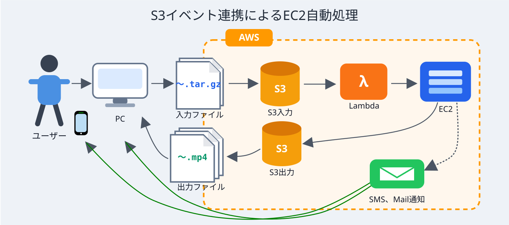

# S3イベント連携によるEC2自動処理

[](LICENSE)

## 概要

AWS S3へのファイルアップロードを契機に、Lambda関数がEC2インスタンスを動的に起動し、バッチ処理（シェルスクリプト）を自動実行するイベント駆動型システムです。処理完了後はアウトプット(結果)をS3に保存してEC2インスタンスを自動削除し、SNS/SESによりメール・SMSで完了通知を送信します。

## 注意
このシステムは、ポートフォリオとして公開しています。本リポジトリのコードを利用したことによる損害について、著作権者は責任を負いません。

## システム概要図



## ディレクトリ構成と役割

- **`src/shell/`**: AWSリソース（VPC, S3, Lambda, IAM Role等）を構築するためのシェルスクリプト群および運用ツールの実ファイル格納場所です。インフラ構築がコード化されています。
- **`src/lambda/`**:
  - `lambda_function.py`: S3トリガーで起動し、設定ファイル（`run.conf`）を検証してEC2を起動する「Startup」役です。
  - `terminator_lambda_function.py`: EC2の停止（Stopped）をEventBridge経由で検知し、インスタンスを削除（Terminate）する「Cleanup」役です。
- **`src/conf/`**: 実行設定ファイル（`run.conf`）および環境変数ファイル（`.env`）の実ファイル格納場所です。`run.conf.skl` をコピーして `run.conf` を、`.env.skl` をコピーして `.env` を作成します。
- **`src/shell/user_data_template.sh`**: EC2起動時に実行されるUserDataスクリプトのテンプレートです。S3からのファイルのダウンロード、ユーザー処理の実行、結果のS3へのアップロード、通知、シャットダウンまでの一連の流れを制御します。
- **`docs/`**: 要件定義、基本設計、セキュリティ設定などの詳細なドキュメントです。
- **`work/`**: `src/shell/`・`src/conf/`・`docs/` 内のファイルへのシンボリックリンクを格納した作業ディレクトリです。このディレクトリから `upl-run.sh` などの運用コマンドを実行します。

## 処理の流れ

1. ユーザーがS3入力バケットに `run.sh`、`run.conf`、`*.tar.gz` などの入力ファイルをアップロードします。
2. Lambdaが起動し、EC2を立ち上げます。
3. EC2上で `run.sh` 等が実行され、結果を出力バケットへ保存します。
4. 処理完了後、EC2は自動停止・削除され、完了通知を送ります。
5. 完了通知を受信後、出力ファイルをダウンロードします。

## ドキュメント一覧

詳細は [`docs/ドキュメント一覧.md`](docs/ドキュメント一覧.md) を参照してください。

| ドキュメント | ファイル |
|-------------|---------|
| 要件定義書 | [docs/設計書/要件定義.md](docs/設計書/要件定義.md) |
| 基本設計書 | [docs/設計書/基本設計.md](docs/設計書/基本設計.md) |
| 命名基準書 | [docs/設計書/命名基準.md](docs/設計書/命名基準.md) |
| 定義ファイル仕様書 | [docs/設計書/定義ファイル仕様.md](docs/設計書/定義ファイル仕様.md) |
| セキュリティ設定一覧 | [docs/設計書/セキュリティ設定.md](docs/設計書/セキュリティ設定.md) |
| 運用手順書 | [docs/運用手順書/運用手順書.md](docs/運用手順書/運用手順書.md) |
| 構築確認チェックリスト | [docs/構築手順/構築確認チェックリスト.md](docs/構築手順/構築確認チェックリスト.md) |

## 動作環境の前提条件

### pigz のインストール

EC2インスタンス上でバッチ処理を実行する際、`.tar.gz` ファイルの展開に `pigz` を使用します。AMIにプレインストールされていない場合は、以下のコマンドでインストールが必要です。

```bash
sudo yum install -y pigz
```

## 動作確認環境

| 項目 | 内容 |
|------|------|
| AWSリージョン | `ap-northeast-1`(東京) |
| 検証期間 | 2026年4月 ～ 2026年5月 |
| EC2 AMI | `ami-09ed31f8f34719e20`(Amazon Linux 系・公開AMI) |
| 開発環境OS | Linux |
| シェル | bash |
| AWS CLI | v2 |

その他バージョン詳細は [`docs/設計書/`](docs/設計書/) 配下の各設計書を参照してください。

## 免責事項(Disclaimer)

- 本リポジトリは個人の検証・学習を目的として公開しています。
- 本コードを利用して構築される AWS リソース(EC2, S3, Lambda, SNS, SES, CloudWatch 等)の**利用料金は利用者の責任**で発生します。実行前に必ず内容を確認し、不要なリソースは速やかに削除してください(`infra/del-all.sh` 参照)。
- 本コードは **「現状のまま(AS IS)」** で提供され、明示・黙示を問わずいかなる保証も行いません。本コードの使用により生じたいかなる損害についても、作者は一切の責任を負いません。
- 商用環境・本番環境での使用前には、自己責任でセキュリティレビュー・コードレビューを実施してください。

## ライセンス

本プロジェクトは [MIT License](LICENSE) の下で公開されています。

## 作者

Tatsuo Indo ([@indouxp](https://github.com/indouxp))

