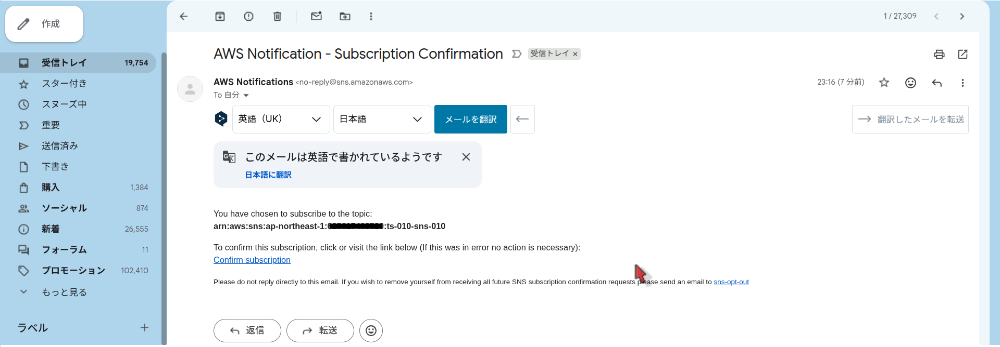
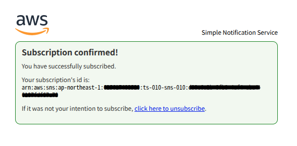

# 構築手順書 - S3イベント連携によるEC2自動処理

## 1. 概要

### 1.1 目的

本文書は、S3イベント連携によるEC2自動処理システムのAWSリソースを構築する手順を定めます。`infra/` ディレクトリに構築用の実行環境を整備し、`src/shell/` 以下のスクリプトを順番に実行することで、必要なリソースをすべて構築できます。

### 1.2 関連文書

**参照文書**
- 基本設計書（[設計書/基本設計.md](../設計書/基本設計.md)）
- セキュリティ設定一覧（[設計書/セキュリティ設定.md](../設計書/セキュリティ設定.md)）
- IAMポリシー要件一覧（[構築手順/IAM_Policy_Requirements.md](IAM_Policy_Requirements.md)）

**派生文書**
- 構築確認チェックリスト（[構築手順/構築確認チェックリスト.md](構築確認チェックリスト.md)）

---

## 2. 前提条件

| # | 前提条件 | 確認方法 |
|---|---------|---------|
| □ | AWSアカウントが利用可能 | AWSコンソールにログインできること |
| □ | 管理者権限を持つIAMユーザー（`ts-usr-admin`）が設定済み | `aws sts get-caller-identity --profile ts-usr-admin` |
| □ | AWS CLI がインストール・設定済み | `aws --version` |
| □ | リージョンが東京（ap-northeast-1）に設定済み | `aws configure get region` |
| □ | SES 送信元メールアドレスが検証済み | AWSコンソール → SES → Verified identities |
| □ | `zip` コマンドが利用可能（Lambda ZIP の生成に使用） | `zip --version` |

---

## 3. infra/ ディレクトリのセットアップ

構築作業はすべて `infra/` ディレクトリで行います。初回のみ以下を実行してください。

```bash
# プロジェクトルートから実行
bash src/shell/mk-infra.sh
```

`infra/` 以下に `src/shell/` の各スクリプトへのシンボリックリンクが作成されます。以降の作業はすべて `infra/` で行います。

```bash
cd infra/
```

---

## 4. 既存リソースのクリア（再構築時）

既存のリソースが残っている場合、`del-all.sh` を使ってすべて削除します。
**初回構築の場合はスキップしてください。**

```bash
# infra/ ディレクトリで実行
AWS_PROFILE=ts-usr-admin ./del-all.sh
```

> **注意**: 削除は不可逆です。実行前に対象リソースを確認してください。

**del-all.sh の削除順序：**

| 順序 | 対象 |
|:---:|------|
| 1 | EC2インスタンス（`ts-010-ec2-010`、`ts-010-ec2-ssh-010`） |
| 2 | EventBridgeルール |
| 3 | Lambda関数（`ts-010-lmd-010`、`ts-010-lmd-020`） |
| 4 | S3トリガー（バケット通知設定） |
| 5 | SNSトピック・サブスクリプション |
| 6 | CloudWatch ロググループ（プロジェクト用 + Lambda 自動作成分） |
| 7 | S3バケット（オブジェクト・バージョンごと削除） |
| 8 | CloudTrail（証跡削除 → ログバケット削除） |
| 9 | キーペア |
| 10 | ネットワーク（SG → サブネット → ルートテーブル → IGW → VPC） |
| 11 | IAMロール・ユーザー |

**削除後の追加作業（IAMユーザーを削除した場合）：**
`del-all.sh` が `ts-010-user` のアクセスキーを削除するため、`~/.aws/credentials` の `[default]` プロファイルが無効になります。IAM再構築後に新しいアクセスキーを発行して更新してください（[6.2参照](#62-iamユーザーのアクセスキー設定)）。

---

## 5. 構築前の設定確認

`src/shell/config.sh` の設定値を確認します。

```bash
cat config.sh
```

主要な設定値：

| 変数名 | デフォルト値 | 説明 |
|--------|------------|------|
| `AWS_REGION` | `ap-northeast-1` | AWSリージョン |
| `PRJ_PREFIX` | `ts-010` | リソース名プレフィックス |
| `PRJ_TAG_KEY` | `PRJ_NAME` | タグキー（全リソースに付与） |
| `PRJ_TAG_VALUE` | `ts-010` | タグ値（`PRJ_PREFIX` と同値） |
| `S3_BKT_IN_NAME` | `${BKT_IN}` | 入力バケット名 |
| `S3_BKT_OUT_NAME` | `${BKT_OUT}` | 出力バケット名 |
| `LAMBDA_FUNC_NAME` | `ts-010-lmd-010` | Lambda起動関数名 |

---

## 6. 構築手順

### 6.0 構築ログの記録（推奨）

各スクリプト実行後に `AWS_PROFILE=ts-usr-admin ./info-all.sh --save` を実行すると、タイムスタンプ付きのスナップショットログが `infra/` に保存されます。障害調査・差分確認に活用してください。

> **注意**: `source ./assume-role.sh` で設定した環境変数（`AWS_ACCESS_KEY_ID` 等）は `AWS_PROFILE` より優先されます。`info-all.sh` 実行前に必ず `unset` してください。

```bash
# スクリプト実行（非IAM系）
source ./assume-role.sh && ./mk-xxx.sh

# ログ記録（任意・推奨）
unset AWS_ACCESS_KEY_ID AWS_SECRET_ACCESS_KEY AWS_SESSION_TOKEN
AWS_PROFILE=ts-usr-admin ./info-all.sh --save

# スクリプト実行（IAM系）
AWS_PROFILE=ts-usr-admin ./mk-xxx.sh

# ログ記録（任意・推奨）
AWS_PROFILE=ts-usr-admin ./info-all.sh --save
```

`info-save` エイリアスを登録すると `unset` + `info-all.sh --save` を1コマンドで実行できます（`work/alias.txt` 参照）。

### 6.1 フェーズ1: IAMリソースの作成

IAM系スクリプトは `AWS_PROFILE=ts-usr-admin` で実行します。`assume-role.sh` は使用しません。

```bash
AWS_PROFILE=ts-usr-admin ./mk-role-build.sh
AWS_PROFILE=ts-usr-admin ./mk-role-exec.sh
AWS_PROFILE=ts-usr-admin ./mk-iam-user.sh
AWS_PROFILE=ts-usr-admin ./mk-role-ec2-010.sh
AWS_PROFILE=ts-usr-admin ./mk-role-lambda-010.sh
```

| スクリプト | 作成リソース |
|-----------|------------|
| `mk-role-build.sh` | IAMロール `ts-010-role-build`（構築用） |
| `mk-role-exec.sh` | IAMロール `ts-010-role-exec`（実行用） |
| `mk-iam-user.sh` | IAMユーザー `ts-010-user` |
| `mk-role-ec2-010.sh` | IAMロール `ts-010-role-ec2-010` + インスタンスプロファイル |
| `mk-role-lambda-010.sh` | IAMロール `ts-010-role-lambda-010` |

### 6.2 IAMユーザーのアクセスキー設定

`mk-iam-user.sh` でユーザーを新規作成・再作成した場合、アクセスキーを発行して `~/.aws/credentials` を更新してください。

```bash
# アクセスキーの発行
AWS_PROFILE=ts-usr-admin aws iam create-access-key --user-name ts-010-user

# 出力された AccessKeyId と SecretAccessKey を credentials に設定
aws configure set aws_access_key_id     <AccessKeyId>     --profile default
aws configure set aws_secret_access_key <SecretAccessKey> --profile default
aws configure set aws_access_key_id     <AccessKeyId>     --profile ts-010-user
aws configure set aws_secret_access_key <SecretAccessKey> --profile ts-010-user

# 確認
aws sts get-caller-identity
```

### 6.3 フェーズ2: ネットワーク基盤の作成

フェーズ2以降は `source assume-role.sh` でAssumeRoleしてから実行します。
AssumeRoleの有効期限は**1時間**です。期限切れの場合は再度 `source assume-role.sh` を実行してください。

```bash
source ./assume-role.sh
```

```bash
./mk-vpc.sh
./mk-igw.sh
./mk-route-table.sh
./mk-subnet.sh
./mk-sg.sh
```

| スクリプト | 作成リソース |
|-----------|------------|
| `mk-vpc.sh` | VPC `ts-010-vpc-010`（CIDR: 10.0.0.0/16） |
| `mk-igw.sh` | インターネットゲートウェイ `ts-010-igw-010` |
| `mk-route-table.sh` | デフォルトルートテーブルに IGW へのルート追加 |
| `mk-subnet.sh` | サブネット `ts-010-subnet-010` |
| `mk-sg.sh` | セキュリティグループ `ts-010-sg-010`（インバウンド全拒否・アウトバウンド全許可） |

> **既存VPCが削除できない場合**: VPC内に依存リソース（EC2インスタンス等）が残っている場合は先に削除してください。`del-all.sh` を使うか、手動でEC2を終了させてから `mk-vpc.sh` を実行してください。

### 6.4 フェーズ3: S3バケットの作成

```bash
source ./assume-role.sh
```

> 実行するたびに新しいセッショントークンが発行され、有効期限がその時点から1時間にリセットされ、既存のトークンは破棄されます。

```bash
./mk-s3bkt.sh
./mk-s3bktpolicy.sh
./mk-s3-lifecicle.sh ${BKT_IN}  7
./mk-s3-lifecicle.sh ${BKT_OUT} 7
```

> `mk-s3-lifecicle.sh` は引数が必要です: `<バケット名> <有効期限(日数)>`

| スクリプト | 作成リソース |
|-----------|------------|
| `mk-s3bkt.sh` | 入力バケット `${BKT_IN}`・出力バケット `${BKT_OUT}`（AES256暗号化・パブリックアクセスブロック済み） |
| `mk-s3bktpolicy.sh` | バケットポリシー（Lambda/EC2ロールのみアクセス許可） |
| `mk-s3-lifecicle.sh` | ライフサイクルルール（指定日数後にオブジェクト削除） |

### 6.5 フェーズ4: CloudWatch ロググループの作成

```bash
source ./assume-role.sh
```

> 実行するたびに新しいセッショントークンが発行され、有効期限がその時点から1時間にリセットされ、既存のトークンは破棄されます。

```bash
./mk-cloudwatch.sh
```

作成されるロググループ：
- `ts-010-log-lambda-010`
- `ts-010-log-ec2-010`
- `ts-010-log-system-010`

### 6.6 フェーズ5: SNSトピックの作成と通知先設定

```bash
source ./assume-role.sh
```

> 実行するたびに新しいセッショントークンが発行され、有効期限がその時点から1時間にリセットされ、既存のトークンは破棄されます。

```bash
./mk-sns-topic.sh
```

**通知先の設定（実際の電話番号・メールアドレスで手動実行）：**

```bash
./set-sms-subscription.sh   +81901234XXXX
./set-email-subscription.sh your-email@example.com
```

実行後、登録したメールアドレスに以下の確認メールが届きます。



メール内の **Confirm subscription** リンクをクリックすると、以下の画面が表示されサブスクリプションが有効化されます（`PendingConfirmation` → `Confirmed`）。



### 6.7 フェーズ6: Lambda起動関数のデプロイ

```bash
source ./assume-role.sh
```

> 実行するたびに新しいセッショントークンが発行され、有効期限がその時点から1時間にリセットされ、既存のトークンは破棄されます。

```bash
./mk-lambda.sh
```

| スクリプト | 内容 |
|-----------|------|
| `mk-lambda.sh` | Lambda関数 `ts-010-lmd-010` のデプロイ（`src/lambda/lambda_function.py` をZIP化）。**S3トリガー（`mk-s3-trigger.sh`）を自動実行します。** |

> **注意**: Lambda 関数を削除・再作成するとリソースベースポリシー（S3トリガー）が失われます。`mk-lambda.sh` は内部で `mk-s3-trigger.sh` を自動実行するため、`mk-s3-trigger.sh` を手動実行する必要はありません。

### 6.8 フェーズ7: Lambda終了関数と EventBridge のデプロイ

```bash
source ./assume-role.sh
```

> 実行するたびに新しいセッショントークンが発行され、有効期限がその時点から1時間にリセットされ、既存のトークンは破棄されます。

```bash
./mk-lambda-terminator.sh
./mk-eventbridge-rule.sh
```

| スクリプト | 内容 |
|-----------|------|
| `mk-lambda-terminator.sh` | IAMロール `ts-010-role-lambda-020` の作成 + Lambda関数 `ts-010-lmd-020` のデプロイ |
| `mk-eventbridge-rule.sh` | EC2停止イベントで `ts-010-lmd-020` が起動するEventBridgeルール設定 |

### 6.9 フェーズ8: キーペアの作成

```bash
source ./assume-role.sh
```

> 実行するたびに新しいセッショントークンが発行され、有効期限がその時点から1時間にリセットされ、既存のトークンは破棄されます。

```bash
./mk-keypair.sh
```

| スクリプト | 内容 |
|-----------|------|
| `mk-keypair.sh` | EC2インスタンス起動に必要なキーペア `ts-010-keypair` を作成し、秘密鍵ファイル（`.pem`）をローカルに保存 |

> **注意**: `run.conf` の `key_name` に `ts-010-keypair` が指定されているため、このキーペアは **必須** です。`del-all.sh` 実行後は消失するため、インフラ再構築時は必ず実行してください。

### 6.10 フェーズ9: 任意リソースの作成

必要に応じて以下を実行してください。

```bash
source ./assume-role.sh
```

> 実行するたびに新しいセッショントークンが発行され、有効期限がその時点から1時間にリセットされ、既存のトークンは破棄されます。

```bash
# SSH用セキュリティグループルール追加
./mk-sg-ssh.sh

# SSH接続確認用EC2インスタンス（テスト・デバッグ用）
./mk-ec2-with-ssh.sh

# CloudTrail（操作ログの記録が必要な場合）
./set-cloud-trail.sh
```

---

## 7. 構築後の確認

[構築手順/構築確認チェックリスト.md](構築確認チェックリスト.md) に従って全リソースを確認してください。

### デプロイ内容の確認

Lambda に登録されている UserData テンプレートの内容を確認します。

```bash
bash src/shell/aws-cat-user_data_template.sh
```

---

## 8. 総合動作確認

構築が完了したら、以下の手順でエンドツーエンドの動作を確認します。

1. `work/run.conf` を編集し、通知先メールアドレス・SMS番号を設定します。
2. 定義ファイルと実行ファイルを入力バケットにアップロードします。

```bash
aws s3 cp work/run.conf s3://${BKT_IN}/
aws s3 cp work/run.sh   s3://${BKT_IN}/
```

3. Lambda ログを監視します。

```bash
aws logs tail ts-010-log-lambda-010 --follow
```

4. EC2 が起動したことを確認します。

```bash
aws ec2 describe-instances \
  --filters Name=tag:Name,Values=ts-010-ec2-010 \
  --query 'Reservations[].Instances[].{Id:InstanceId,State:State.Name}'
```

5. 処理完了後、結果ファイルが出力バケットに保存されていることを確認します。

```bash
aws s3 ls s3://${BKT_OUT}/
```

6. SMS・メール通知が届いていることを確認します。

---

## 9. 各スクリプトのログ

各スクリプトは実行ディレクトリ（`infra/`）に `<スクリプト名>.log` を出力します。エラーが発生した場合はログファイルを確認してください。

```bash
cat mk-vpc.sh.log
```

---

**作成日**: 2026年3月4日
**更新日**: 2026年3月25日
**バージョン**: 1.1
**作成者**: tsystem
**承認者**: tsystem
