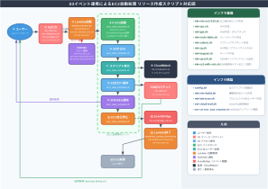

# 構築確認チェックリスト - S3イベント連携によるEC2自動処理

## 概要

本チェックリストは、`src/` 以下のスクリプト実行後に AWS リソースが正しく作成されているかを確認するためのものです。

### 関連文書

**参照文書**
- 構築手順書（[構築手順/構築手順書.md](構築手順書.md)）
- セキュリティ設定一覧（[設計書/セキュリティ設定.md](../設計書/セキュリティ設定.md)）

## リソース作成スクリプト対応図



---

## 事前準備

| # | 確認項目 | 確認コマンド / 確認内容 |
|---|----------|------------------------|
| ✔ | `config.sh` の設定値（`PRJ_PREFIX`, `AWS_REGION`, `PRJ_TAG_KEY`, `PRJ_TAG_VALUE` 等）が正しい | `cat src/shell/config.sh` |
| ✔ | AWS CLI の認証情報が設定済み | `aws sts get-caller-identity` |
| ✔ | SES 送信元メールアドレスが検証済み | AWSコンソール → SES → Verified identities |

### AWS 認証情報のリセット

`source ./assume-role.sh` で設定した環境変数（`AWS_ACCESS_KEY_ID` 等）は `AWS_PROFILE` より優先されます。
IAM 系コマンド実行前や `info-all.sh` 実行前に必ず解除してください。

`work/alias.txt`（または `src/shell/alias.txt`）を source しておくと `unset-aws` が使えます。

```bash
# alias の読み込み（セッション開始時に1度実行）
source work/alias.txt

# 環境変数のリセット（unset-aws エイリアスの中身）
alias unset-aws='unset AWS_ACCESS_KEY_ID AWS_SECRET_ACCESS_KEY AWS_SESSION_TOKEN'

# 実行例
unset-aws
```

### 構築ログの記録

各スクリプト実行後に `info-all.sh --save` を実行し、タイムスタンプ付きスナップショットを保存してください。

```bash
# 非IAM系スクリプト実行後
unset-aws
AWS_PROFILE=ts-usr-admin ./info-all.sh --save

# IAM系スクリプト実行後
AWS_PROFILE=ts-usr-admin ./info-all.sh --save
```

---

## 1. インフラ基盤

### 1.1 VPC

| # | スクリプト | 確認コマンド |
|---|-----------|-------------|
| ✔ | `mk-vpc.sh` | `aws ec2 describe-vpcs --filters Name=tag:Name,Values=ts-010-vpc-010 --query 'Vpcs[].{VpcId:VpcId,State:State}'` |

```
$ source ./assume-role.sh 
[INFO] AssumeRole: arn:aws:iam::************:role/ts-010-role-build
[INFO] AssumeRole 完了
[INFO] ロール  : ts-010-role-build
[INFO] 有効期限: 2026-03-27T03:16:00+00:00
[INFO] 現在のID:
{
    "UserId": "AROAZDKNT72AHA6SR2DJD:user-YYYYMMDDHHMMSS",
    "Account": "************",
    "Arn": "arn:aws:sts::************:assumed-role/ts-010-role-build/user-YYYYMMDDHHMMSS"
}
$ aws ec2 describe-vpcs --filters Name=tag:Name,Values=ts-010-vpc-010 --query 'Vpcs[].{VpcId:VpcId,State:State}'
[
    {
        "VpcId": "vpc-xxxxxxxxxxxxxxxxx",
        "State": "available"
    }
]
$ 
```

### 1.2 インターネットゲートウェイ

| # | スクリプト | 確認コマンド |
|---|-----------|-------------|
| ✔ | `mk-igw.sh` | `aws ec2 describe-internet-gateways --filters Name=tag:Name,Values=ts-010-igw-010 --query 'InternetGateways[].{IgwId:InternetGatewayId,Attachments:Attachments}'` |

```
$ aws ec2 describe-internet-gateways --filters Name=tag:Name,Values=ts-010-igw-010 --query 'InternetGateways[].{IgwId:InternetGatewayId,Attachments:Attachments}'
[
    {
        "IgwId": "igw-xxxxxxxxxxxxxxxxx",
        "Attachments": [
            {
                "State": "available",
                "VpcId": "vpc-xxxxxxxxxxxxxxxxx"
            }
        ]
    }
]
$ 
```

### 1.3 ルートテーブル

| # | スクリプト | 確認コマンド |
|---|-----------|-------------|
| ✔ | `mk-route-table.sh` | `aws ec2 describe-route-tables --filters Name=tag:Name,Values=ts-010-rtt-010 --query 'RouteTables[].Routes'` |

```
$ aws ec2 describe-route-tables --filters Name=tag:Name,Values=ts-010-rtt-010 --query 'RouteTables[].Routes'
[
    [
        {
            "DestinationCidrBlock": "10.0.0.0/16",
            "GatewayId": "local",
            "Origin": "CreateRouteTable",
            "State": "active"
        },
        {
            "DestinationCidrBlock": "0.0.0.0/0",
            "GatewayId": "igw-xxxxxxxxxxxxxxxxx",
            "Origin": "CreateRoute",
            "State": "active"
        }
    ]
]
$ 
```

### 1.4 サブネット

| # | スクリプト | 確認コマンド |
|---|-----------|-------------|
| ✔ | `mk-subnet.sh` | `aws ec2 describe-subnets --filters Name=tag:Name,Values=ts-010-subnet-010 --query 'Subnets[].{SubnetId:SubnetId,CidrBlock:CidrBlock,State:State}'` |

```
$ aws ec2 describe-subnets --filters Name=tag:Name,Values=ts-010-subnet-010 --query 'Subnets[].{SubnetId:SubnetId,CidrBlock:CidrBlock,State:State}'
[
    {
        "SubnetId": "subnet-xxxxxxxxxxxxxxxxx",
        "CidrBlock": "10.0.1.0/24",
        "State": "available"
    }
]
$ 
```

### 1.5 セキュリティグループ

| # | スクリプト | 確認コマンド |
|---|-----------|-------------|
| ✔ | `mk-sg.sh` | `aws ec2 describe-security-groups --filters Name=group-name,Values=ts-010-sg-010 --query 'SecurityGroups[].{GroupId:GroupId,IpPermissions:IpPermissions}'` |
| ✔ | `mk-sg-ssh.sh`（任意） | 上記コマンドで `IpPermissions` に SSH ポート 22 のルールが含まれること |

```
$ aws ec2 describe-security-groups --filters Name=group-name,Values=ts-010-sg-010 --query 'SecurityGroups[].{GroupId:GroupId,IpPermissions:IpPermissions}'
[
    {
        "GroupId": "sg-xxxxxxxxxxxxxxxxx",
        "IpPermissions": [
            {
                "IpProtocol": "tcp",
                "FromPort": 22,
                "ToPort": 22,
                "UserIdGroupPairs": [],
                "IpRanges": [
                    {
                        "CidrIp": "***.***.***.***/**"
                    }
                ],
                "Ipv6Ranges": [],
                "PrefixListIds": []
            }
        ]
    }
]
$ 
```

### 1.6 IAM ロール（EC2用）

| # | スクリプト | 確認コマンド |
|---|-----------|-------------|
| ✔ | `mk-role-ec2-010.sh` | `aws iam get-role --role-name ts-010-role-ec2-010 --query 'Role.RoleName'`<br /><br />IAM ロール ts-010-role-ec2-010 が存在することの確認 |
|   |                      | `aws iam list-attached-role-policies --role-name ts-010-role-ec2-010`<br /><br />管理ポリシー `CloudWatchAgentServerPolicy` がアタッチされていること |
|   |                      | `aws iam list-role-policies --role-name ts-010-role-ec2-010`<br /><br />インラインポリシー名の一覧確認（`ts-010-ec2-custom-policy` が存在すること） |
|   |                      | `aws iam get-role-policy --role-name ts-010-role-ec2-010 --policy-name ts-010-ec2-custom-policy`<br /><br />インラインポリシーの内容確認（S3 読み書き・SNS・SES・CloudWatch Logs・EC2 終了権限） |
|   |                      | `aws iam get-instance-profile --instance-profile-name ts-010-role-ec2-010 --query 'InstanceProfile.InstanceProfileName'`<br /><br />インスタンスプロファイル（EC2 がロールを引き受けるための別エンティティ）が存在すること |

```
$ AWS_PROFILE=ts-usr-admin aws iam get-role --role-name ts-010-role-ec2-010 --query 'Role.RoleName'
ts-010-role-ec2-010
$
$ AWS_PROFILE=ts-usr-admin aws iam list-attached-role-policies --role-name ts-010-role-ec2-010
ATTACHEDPOLICIES        arn:aws:iam::aws:policy/CloudWatchAgentServerPolicy     CloudWatchAgentServerPolicy
$
$ AWS_PROFILE=ts-usr-admin aws iam list-role-policies --role-name ts-010-role-ec2-010
POLICYNAMES     ts-010-ec2-custom-policy
$
$ AWS_PROFILE=ts-usr-admin aws iam get-role-policy --role-name ts-010-role-ec2-010 --policy-name ts-010-ec2-custom-policy
ts-010-ec2-custom-policy        ts-010-role-ec2-010
POLICYDOCUMENT  2012-10-17
STATEMENT       Allow   ['arn:aws:s3:::${BKT_IN}', 'arn:aws:s3:::${BKT_IN}/*']
ACTION  s3:GetObject
ACTION  s3:ListBucket
STATEMENT       Allow   ['arn:aws:s3:::${BKT_OUT}', 'arn:aws:s3:::${BKT_OUT}/*']
ACTION  s3:PutObject
ACTION  s3:ListBucket
STATEMENT       Allow   *
ACTION  sns:Publish
STATEMENT       Allow   *
ACTION  ses:SendEmail
ACTION  ses:SendRawEmail
STATEMENT       Allow   arn:aws:logs:ap-northeast-1:*:log-group:ts-010-log-*
ACTION  logs:CreateLogGroup
ACTION  logs:CreateLogStream
ACTION  logs:PutLogEvents
STATEMENT       Allow   *
ACTION  ec2:TerminateInstances
STRINGEQUALS    ts-010-ec2-010
$
$ AWS_PROFILE=ts-usr-admin aws iam get-instance-profile --instance-profile-name ts-010-role-ec2-010 --query 'InstanceProfile.InstanceProfileName'
ts-010-role-ec2-010
$ 
```

### 1.7 キーペア

| # | スクリプト | 確認コマンド |
|---|-----------|-------------|
| ✔ | `mk-keypair.sh` | `aws ec2 describe-key-pairs --key-names ts-010-keypair --query 'KeyPairs[].KeyName'` |

```
$ AWS_PROFILE=ts-usr-admin aws ec2 describe-key-pairs --key-names ts-010-keypair --query 'KeyPairs[].KeyName'
ts-010-keypair
$ 
```

### 1.8 SSH接続用 EC2（任意・テスト用）

| # | スクリプト | 確認コマンド |
|---|-----------|-------------|
| □ | `mk-ec2-with-ssh.sh`（任意） | `aws ec2 describe-instances --filters Name=tag:Name,Values=ts-010-ec2-ssh-010 --query 'Reservations[].Instances[].{Id:InstanceId,State:State.Name}'` |

---

## 2. IAM・管理系

| # | スクリプト | 確認コマンド |
|---|-----------|-------------|
| ✔ | `mk-role-build.sh` | `aws iam get-role --role-name ts-010-role-build --query 'Role.RoleName'` |
|   |                    | `aws iam list-role-policies --role-name ts-010-role-build --query 'PolicyNames'` |
| ✔ | `mk-iam-user.sh` | `aws iam get-user --user-name ts-010-user --query 'User.UserName'` |
|   |                  | `aws iam list-user-tags --user-name ts-010-user --query 'Tags'` |

```
$ AWS_PROFILE=ts-usr-admin aws iam get-role --role-name ts-010-role-build --query 'Role.RoleName'
ts-010-role-build
$
$ AWS_PROFILE=ts-usr-admin aws iam list-role-policies --role-name ts-010-role-build --query 'PolicyNames'
ts-010-role-build-policy
$
$ AWS_PROFILE=ts-usr-admin aws iam get-user --user-name ts-010-user --query 'User.UserName'
ts-010-user
$ 
$ AWS_PROFILE=ts-usr-admin aws iam list-user-tags --user-name ts-010-user --query 'Tags'
PRJ_NAME        ts-010
0 [2.54s] 260327-131643 user@hostname:~/run_on_ec2/infra:
$ 
```

---

## 3. S3 バケット

| # | スクリプト | 確認コマンド |
|---|-----------|-------------|
| ✔ | `mk-s3bkt.sh`（入力） | `aws s3api head-bucket --bucket ${BKT_IN}` |
|   |                       | `aws s3api get-bucket-tagging --bucket ${BKT_IN}` |
| ✔ | `mk-s3bkt.sh`（出力） | `aws s3api head-bucket --bucket ${BKT_OUT}` |
|   |                       | `aws s3api get-bucket-tagging --bucket ${BKT_OUT}` |
| ✔ | `mk-s3bktpolicy.sh` | `aws s3api get-bucket-policy --bucket ${BKT_IN}` |
|   |                     | `aws s3api get-bucket-policy --bucket ${BKT_OUT}` |
| ✔ | `mk-s3-lifecicle.sh` | `aws s3api get-bucket-lifecycle-configuration --bucket ${BKT_IN}` |
|   |                      | `aws s3api get-bucket-lifecycle-configuration --bucket ${BKT_OUT}` |

```
$ AWS_PROFILE=ts-usr-admin aws s3api head-bucket --bucket ${BKT_IN}
False   arn:aws:s3:::${BKT_IN}      ap-northeast-1
$ 
※S3 アクセスポイントエイリアスかどうか。False = 通常のバケット（正常）
$ AWS_PROFILE=ts-usr-admin aws s3api get-bucket-tagging --bucket ${BKT_IN}
TAGSET  PRJ_NAME        ts-010
$ 
$ AWS_PROFILE=ts-usr-admin aws s3api head-bucket --bucket ${BKT_OUT}
False   arn:aws:s3:::${BKT_OUT}     ap-northeast-1
$
※S3 アクセスポイントエイリアスかどうか。False = 通常のバケット（正常）
$ AWS_PROFILE=ts-usr-admin aws s3api get-bucket-tagging --bucket ${BKT_OUT}
TAGSET  PRJ_NAME        ts-010
$ 
$ AWS_PROFILE=ts-usr-admin aws s3api get-bucket-policy --bucket ${BKT_IN}
{"Version":"2012-10-17","Statement":[{"Sid":"AllowLambdaRoleAccess","Effect":"Allow","Principal":{"AWS":"arn:aws:iam::123456789012:role/ts-010-role-lambda-010"},"Action":["s3:GetObject","s3:ListBucket"],"Resource":["arn:aws:s3:::${BKT_IN}","arn:aws:s3:::${BKT_IN}/*"]},{"Sid":"AllowEC2RoleAccess","Effect":"Allow","Principal":{"AWS":"arn:aws:iam::123456789012:role/ts-010-role-ec2-010"},"Action":["s3:GetObject","s3:ListBucket"],"Resource":["arn:aws:s3:::${BKT_IN}","arn:aws:s3:::${BKT_IN}/*"]}]}
$ 
$ AWS_PROFILE=ts-usr-admin aws s3api get-bucket-policy --bucket ${BKT_OUT}
{"Version":"2012-10-17","Statement":[{"Sid":"AllowLambdaRoleAccess","Effect":"Allow","Principal":{"AWS":"arn:aws:iam::123456789012:role/ts-010-role-lambda-010"},"Action":["s3:PutObject","s3:ListBucket"],"Resource":["arn:aws:s3:::${BKT_OUT}","arn:aws:s3:::${BKT_OUT}/*"]},{"Sid":"AllowEC2RoleAccess","Effect":"Allow","Principal":{"AWS":"arn:aws:iam::123456789012:role/ts-010-role-ec2-010"},"Action":["s3:PutObject","s3:ListBucket"],"Resource":["arn:aws:s3:::${BKT_OUT}","arn:aws:s3:::${BKT_OUT}/*"]}]}
$
$ AWS_PROFILE=ts-usr-admin aws s3api get-bucket-lifecycle-configuration --bucket ${BKT_IN}
all_storage_classes_128K
RULES   ${BKT_IN}-expire-3d-created_at=2026-03-26T14:15:30Z Enabled
EXPIRATION      3
FILTER  
$ 
$ AWS_PROFILE=ts-usr-admin aws s3api get-bucket-lifecycle-configuration --bucket ${BKT_OUT}
all_storage_classes_128K
RULES   ${BKT_OUT}-expire-3d-created_at=2026-03-26T14:15:43Z        Enabled
EXPIRATION      3
FILTER  
$ 
```

---

## 4. CloudWatch ロググループ

| # | スクリプト | 確認コマンド |
|---|-----------|-------------|
| ✔ | `mk-cloudwatch.sh` | `aws logs describe-log-groups --log-group-name-prefix ts-010-log --query 'logGroups[].logGroupName'` |
|   |                    | `ts-010-log-lambda-010` / `ts-010-log-ec2-010` / `ts-010-log-system-010` の3グループが存在すること |

```
$ AWS_PROFILE=ts-usr-admin aws logs describe-log-groups --log-group-name-prefix ts-010-log --query 'logGroups[].logGroupName'
ts-010-log-ec2-010      ts-010-log-lambda-010   ts-010-log-system-010
$ 
```

---

## 5. Lambda 起動関数

| # | スクリプト | 確認コマンド |
|---|-----------|-------------|
| ✔ | `mk-role-lambda-010.sh` | `aws iam get-role --role-name ts-010-role-lambda-010 --query 'Role.RoleName'` |
| ✔ | `mk-lambda.sh` | `aws lambda get-function --function-name ts-010-lmd-010 --query 'Configuration.{Name:FunctionName,State:State}'` |
|   |                | `aws lambda get-function --function-name ts-010-lmd-010 --query 'Tags'` |
| ✔ | `mk-s3-trigger.sh`（自動） | `aws s3api get-bucket-notification-configuration --bucket ${BKT_IN} --query 'LambdaFunctionConfigurations'` |
|   |                            | `.conf` ファイルの `ObjectCreated` イベントで `ts-010-lmd-010` が紐付いていること |
|   |                            | **`mk-lambda.sh` が自動実行するため手動実行不要** |

```
$ AWS_PROFILE=ts-usr-admin aws iam get-role --role-name ts-010-role-lambda-010 --query 'Role.RoleName'
ts-010-role-lambda-010
$ 
$ AWS_PROFILE=ts-usr-admin aws lambda get-function --function-name ts-010-lmd-010 --query 'Configuration.{Name:FunctionName,State:State}'
ts-010-lmd-010  Active
$ 
$ AWS_PROFILE=ts-usr-admin aws lambda get-function --function-name ts-010-lmd-010 --query 'Tags'
ts-010
$ 
$ AWS_PROFILE=ts-usr-admin aws s3api get-bucket-notification-configuration --bucket ${BKT_IN} --query 'LambdaFunctionConfigurations'
lambda-trigger-for-conf-files   arn:aws:lambda:ap-northeast-1:123456789012:function:ts-010-lmd-010
EVENTS  s3:ObjectCreated:*
FILTERRULES     Suffix  .conf
$ 
```

---

## 6. SNS 通知

| # | スクリプト | 確認コマンド |
|---|-----------|-------------|
| ✔ | `mk-sns-topic.sh` | `aws sns list-topics --query 'Topics[].TopicArn' \| grep ts-010-sns-010` |
| ✔ | `set-sms-subscription.sh` | `aws sns list-subscriptions-by-topic --topic-arn <TopicArn> --query 'Subscriptions[?Protocol==\`sms\`]'` |
| ✔ | `set-email-subscription.sh` | `aws sns list-subscriptions-by-topic --topic-arn <TopicArn> --query 'Subscriptions[?Protocol==\`email\`]'` |
|   |                             | サブスクリプションのステータスが `PendingConfirmation` の場合はメール確認が必要 |

```
$ AWS_PROFILE=ts-usr-admin aws sns list-topics --query 'Topics[].TopicArn' | grep ts-010-sns-010
arn:aws:sns:ap-northeast-1:123456789012:ts-010-sns-010
$ 
$ AWS_PROFILE=ts-usr-admin aws sns list-subscriptions-by-topic --topic-arn arn:aws:sns:ap-northeast-1:************:ts-010-sns-010 --query 'Subscriptions[?Protocol==`sms`]'
+8190********   ************    sms     arn:aws:sns:ap-northeast-1:************:ts-010-sns-010:669be559-a91b-4924-a375-ae58881e1d50     arn:aws:sns:ap-northeast-1:************:ts-010-sns-010
$ 
$ AWS_PROFILE=ts-usr-admin aws sns list-subscriptions-by-topic --topic-arn arn:aws:sns:ap-northeast-1:123456789012:ts-010-sns-010 --query 'Subscriptions[?Protocol==`email`]'
user@mail.com ************    email   arn:aws:sns:ap-northeast-1:************:ts-010-sns-010:a9fc0ea6-992f-43f9-ab0d-3c31461262ef     arn:aws:sns:ap-northeast-1:************:ts-010-sns-010
$ 
```

---

## 7. EventBridge + Lambda 終了関数

| # | スクリプト | 確認コマンド |
|---|-----------|-------------|
| ✔ | `mk-role-exec.sh` | `aws iam get-role --role-name ts-010-role-exec --query 'Role.RoleName'` |
| ✔ | `mk-lambda-terminator.sh` | `aws iam get-role --role-name ts-010-role-lambda-020 --query 'Role.RoleName'` |
|   |                           | `aws lambda get-function --function-name ts-010-lmd-020 --query 'Configuration.{Name:FunctionName,State:State}'` |
| ✔ | `mk-eventbridge-rule.sh` | `aws events describe-rule --name ts-010-rule-stop-ec2-trigger --query '{Name:Name,State:State}'` |
|   |                          | `aws events list-targets-by-rule --rule ts-010-rule-stop-ec2-trigger --query 'Targets[].Arn'` |

```
$ AWS_PROFILE=ts-usr-admin aws iam get-role --role-name ts-010-role-exec --query 'Role.RoleName'
ts-010-role-exec
$ 
$ AWS_PROFILE=ts-usr-admin aws iam get-role --role-name ts-010-role-lambda-020 --query 'Role.RoleName'
ts-010-role-lambda-020
$ 
$ AWS_PROFILE=ts-usr-admin aws lambda get-function --function-name ts-010-lmd-020 --query 'Configuration.{Name:FunctionName,State:State}'
ts-010-lmd-020  Active
$ 
$ AWS_PROFILE=ts-usr-admin aws events describe-rule --name ts-010-rule-stop-ec2-trigger --query '{Name:Name,State:State}'
ts-010-rule-stop-ec2-trigger    ENABLED
$ 
$ AWS_PROFILE=ts-usr-admin aws events list-targets-by-rule --rule ts-010-rule-stop-ec2-trigger --query 'Targets[].Arn'
arn:aws:lambda:ap-northeast-1:***********:function:ts-010-lmd-020
$ 
```


---

## 8. 監視・管理

| # | スクリプト | 確認コマンド |
|---|-----------|-------------|
| ✔ | `set-cloud-trail.sh`（任意） | `aws cloudtrail describe-trails --query 'trailList[].{Name:Name,S3BucketName:S3BucketName}'` |
|   |                              | `aws cloudtrail get-trail-status --name ts-010-trail-010 --query '{IsLogging:IsLogging}'` |

```
$ AWS_PROFILE=ts-usr-admin aws cloudtrail describe-trails --query 'trailList[].{Name:Name,S3BucketName:S3BucketName}'
ts-010-trail-010        ${BKT_CLOUDTRAIL}
$ 
$ AWS_PROFILE=ts-usr-admin aws cloudtrail get-trail-status --name ts-010-trail-010 --query '{IsLogging:IsLogging}'
True
$ 
```

---

## 9. デプロイ確認

Lambda 関数に埋め込まれた UserData テンプレートの内容を確認します。

| # | スクリプト | 確認内容 |
|---|-----------|----------|
| ✔ | `aws-cat-user_data_template.sh` | Lambda に登録されている `user_data_template.sh` の内容が最新であること |

```
$ AWS_PROFILE=ts-usr-admin ./aws-cat-user_data_template.sh 
[INFO] AWS上のuser_data_template.sh確認処理を開始します。
[INFO] 作業用ディレクトリ: /tmp/aws-cat-user_data_template.sh.6phhjH
[INFO] Lambda関数 [ts-010-lmd-010] の構成情報を取得します。
---------------------------------------------------------------------------
|                               GetFunction                               |
+--------------+----------------------------------------------------------+
|  CodeSize    |  11117                                                   |
|  FunctionName|  ts-010-lmd-010                                          |
|  LastModified|  2026-03-26T14:33:00.244+0000                            |
|  RevisionId  |  e53f8ddc-d6d0-4967-93b2-8cf6eac998ca                    |
|  Role        |  arn:aws:iam::************:role/ts-010-role-lambda-010   |
|  Runtime     |  python3.12                                              |
|  Version     |  $LATEST                                                 |
+--------------+----------------------------------------------------------+
[INFO] Lambdaコードをダウンロード中...
[INFO] Lambdaコードを保存しました: /tmp/aws-cat-user_data_template.sh.6phhjH/lambda_package.zip
[INFO] 展開されたuser_data_template.shの内容を表示します。
----- /tmp/aws-cat-user_data_template.sh.6phhjH/extracted/user_data_template.sh -----
#!/bin/bash
################################################################################
# EC2のAmazon Linux実行時、user_dataとして、このシェルスクリプトを登録
# lambda_function.pyがこのファイルをテンプレートとして読み込み、
# 中括弧間はプレースホルダーとして指定値に変換されて、シェルスクリプトが生成されます。
# そのため、本来のシェルスクリプトとして使用する中括弧は、中括弧を二重に記述します。 
# このシェル出力は、CloudWatch Agentにより、CloudWatchに出力されます。
#
# Last updated: 2026-03-06 00:31:26
#
MY_NAME=${{0##*/}}

################################################################################
#set -eux # -e: exit on error, -u: exit on unset var, -x: print commands
set -eu # -e: exit on error, -u: exit on unset var

################################################################################
# 標準出力、標準エラー出力を、/var/log/cloud-init-output.log、loggerに出力します
# exec > >(tee /var/log/cloud-init-output.log|logger -t user-data -s 2>/dev/console) 2>&1

################################################################################
# vmの簡易的な性能表示
echo $MY_NAME
set -x
hostname
grep -c ^processor /proc/cpuinfo
free -h
lsblk -d -o NAME,ROTA,SIZE,MODEL
df -h
curl http://169.254.169.254/latest/meta-data/
set +x

################################################################################
echo "Start UserData Script  ---"

################################################################################
# --- CloudWatch Agentのセットアップ ---
echo "Setting up CloudWatch Agent..."
yum install -y amazon-cloudwatch-agent

INSTANCE_ID=$(curl -s http://169.254.169.254/latest/meta-data/instance-id)
CW_AGENT_CONFIG_PATH="/opt/aws/amazon-cloudwatch-agent/bin/config.json"
LOG_GROUP_NAME="{T_PRJ_PREFIX}-log-ec2-010"

# CloudWatch Agent設定ファイルを作成
cat <<EOF > $CW_AGENT_CONFIG_PATH
{{
  "agent": {{
    "run_as_user": "root"
  }},
  "logs": {{
    "logs_collected": {{
      "files": {{
        "collect_list": [
          {{
            "file_path": "/var/log/cloud-init-output.log",
            "log_group_name": "$LOG_GROUP_NAME",
            "log_stream_name": "$INSTANCE_ID",
            "timezone": "UTC"
          }}
        ]
      }}
    }}
  }}
}}
EOF

# CloudWatch Agentを起動
/opt/aws/amazon-cloudwatch-agent/bin/amazon-cloudwatch-agent-ctl -a fetch-config -m ec2 -c file:$CW_AGENT_CONFIG_PATH -s
echo "CloudWatch Agent setup complete."

################################################################################
# --- 設定をシェル変数に格納 T_はテンプレートとのやり取り ---
echo "Loading configuration..."
EXEC_COMMAND="{T_EXEC_COMMAND}"
BUCKET_NAME="{T_BUCKET_NAME}"
OUTPUT_BUCKET="{T_OUTPUT_BUCKET}"
LOG_FILE="{T_LOG_FILE}"
RESULT_FILE="{T_RESULT_FILE}"
MAIL_TO="{T_MAIL_TO}"
SMS_TO="{T_SMS_TO}"
SES_FROM="{T_SES_FROM}"
AWS_REGION="{T_AWS_REGION}" # EC2インスタンスのリージョンを取得します

# --- 実行コマンドをパース ---
echo "Parsing execution command...EXEC_COMMAND: $EXEC_COMMAND"
EXEC_SCRIPT=$(echo $EXEC_COMMAND | cut -d' ' -f1)
INPUT_FILES=$(echo $EXEC_COMMAND | cut -d' ' -f2-)
echo "Parsing execution command...EXEC_SCRIPT: $EXEC_SCRIPT INPUT_FILES: $INPUT_FILES"

cd /home/ec2-user/ || {{ echo "ERROR: Failed to change directory to /home/ec2-user/"; exit 1; }}

# --- 実行スクリプトをダウンロード ---
echo "Downloading execution script: $EXEC_SCRIPT"
aws s3 cp "s3://$BUCKET_NAME/$EXEC_SCRIPT" ./ || {{ echo "FATAL: Failed to download execution script '$EXEC_SCRIPT' from bucket '$BUCKET_NAME'."; exit 1; }}

# --- 入力ファイルをダウンロード ---
if [ -n "$INPUT_FILES" ]; then
    for f in $INPUT_FILES;
    do
        echo "Downloading input file(s) matching pattern: $f"
        aws s3 cp "s3://$BUCKET_NAME/" ./ --recursive --exclude "*" --include "$f" || {{ echo "WARNING: Failed to download or no files found for pattern: $f"; }}
    done
else
    echo "No input files specified to download."
fi

################################################################################
# --- スクリプト実行 ---
chmod +x "$EXEC_SCRIPT" || {{ echo "ERROR: Failed to set execute permission on $EXEC_SCRIPT"; exit 1; }}


START_DATE=$(date '+%Y-%m-%d %H:%M:%S')
echo "Executing command: ./$EXEC_COMMAND at $START_DATE"

set +e
CMD="./$EXEC_SCRIPT $INPUT_FILES"
echo "Running command as ec2-user: $CMD"
su - ec2-user -c "$CMD" > "$LOG_FILE" 2>&1
EXEC_EXIT_CODE=$?
set -e

END_DATE=$(date '+%Y-%m-%d %H:%M:%S')
echo "Execution finished with exit code: $EXEC_EXIT_CODE at $END_DATE"

################################################################################
# --- 成果物をアップロード ---
echo "Uploading log file: $LOG_FILE"
aws s3 cp "$LOG_FILE" "s3://$OUTPUT_BUCKET/" || {{ echo "ERROR: Failed to upload log file $LOG_FILE"; }}

for RESULT in $RESULT_FILE; do
    echo "Uploading result file: $RESULT"
    aws s3 cp "$RESULT" "s3://$OUTPUT_BUCKET/" || {{ echo "ERROR: Failed to upload result file $RESULT"; }}
done

################################################################################
# --- 実行結果を通知 ---
echo "Sending notification..."

if [ $EXEC_EXIT_CODE -eq 0 ]; then
    SUBJECT="SUCCESS: Job '$EXEC_SCRIPT' executed successfully"
    MESSAGE="Job '$EXEC_SCRIPT' completed successfully. $START_DATE - $END_DATE\n\nLog file: s3://$OUTPUT_BUCKET/$LOG_FILE\nResult file: s3://$OUTPUT_BUCKET/$RESULT_FILE"
else
    SUBJECT="FAILED: Job '$EXEC_SCRIPT' failed with exit code $EXEC_EXIT_CODE"
    MESSAGE="Job '$EXEC_SCRIPT' failed with exit code $EXEC_EXIT_CODE. $START_DATE - $END_DATE\\n\nCheck the log file for details: s3://$OUTPUT_BUCKET/$LOG_FILE"
fi

################################################################################
# SMS通知
echo "SMS: $SMS_TO"
if [ -n "$SMS_TO" ]; then
    aws sns publish \
      --phone-number "$SMS_TO" \
      --message "$SUBJECT" \
      --region "$AWS_REGION" \
    || {{ echo "ERROR: Failed to send SMS notification"; }}
fi

################################################################################
# Email通知
echo "Email: $MAIL_TO"
if [ -n "$MAIL_TO" ] && [ -n "$SES_FROM" ]; then
    MESSAGE_BODY=$(cat <<EOM
{{
  "Subject": {{
    "Data": "$SUBJECT",
    "Charset": "UTF-8"
  }},
  "Body": {{
    "Text": {{
      "Data": "$MESSAGE",
      "Charset": "UTF-8"
    }}
  }}
}}
EOM
)
    DESTINATION_JSON=$(printf '{{"ToAddresses": ["%s"]}}' "$MAIL_TO")
    aws ses send-email --from "$SES_FROM" --destination "$DESTINATION_JSON" --message "$MESSAGE_BODY" --region "$AWS_REGION" || {{ echo "ERROR: Failed to send Email notification"; }}
fi

################################################################################
echo "--- All tasks finished. Terminating instance. ---"
sleep 30 # CloudWatch Agentがログを送信するのを待ちます
shutdown -h now
----- end of /tmp/aws-cat-user_data_template.sh.6phhjH/extracted/user_data_template.sh -----
[INFO] 処理が完了しました。
$ 
```

---

## 10. 総合動作確認

| # | 確認項目 | 手順 |
|---|----------|------|
| □ | 定義ファイル（`.conf`）を `${BKT_IN}` にアップロードする | `aws s3 cp work/run.conf s3://${BKT_IN}/` |
| □ | Lambda `ts-010-lmd-010` が自動起動することを確認 | `aws logs tail ts-010-log-lambda-010 --follow` |
| □ | EC2 インスタンスが起動することを確認 | `aws ec2 describe-instances --filters Name=tag:Name,Values=ts-010-ec2-010 --query 'Reservations[].Instances[].State.Name'` |
| □ | 処理完了後に EC2 が自動停止・削除されることを確認 | `aws ec2 describe-instances --filters Name=tag:Name,Values=ts-010-ec2-010 --query 'Reservations[].Instances[].State.Name'` |
| □ | 結果ファイルが `${BKT_OUT}` に保存されていることを確認 | `aws s3 ls s3://${BKT_OUT}/` |
| □ | SMS・メール通知が届いていることを確認 | — |

---

**作成日**: 2026年2月27日
**更新日**: 2026年3月30日
**バージョン**: 0.5
**作成者**: tsystem
**承認者**: tsystem
