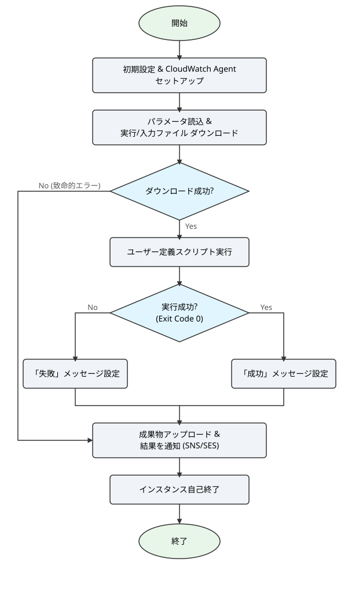

# UserDataスクリプト 詳細設計書

## 1. 概要

### 1.1 目的
本ドキュメントは、EC2インスタンス起動時に `UserData` として実行されるシェルスクリプトの詳細な設計を定義します。

Amazon Linux 2のUserDataとして実行されるシェルスクリプトは、`user_data_template.sh` をもとに、Lambda関数によって動的に生成されます。この処理は、EC2インスタンス上で完全に自律して動作します。主な責務は以下の通りです。

- 実行環境のセットアップ
- S3からのファイルダウンロード
- ユーザー定義のシェルスクリプトの実行
- ログと結果ファイルのS3へのアップロード
- 実行結果のメールおよびSMSでの通知
- 処理完了後のインスタンスの自己終了

### 1.2 関連文書

**参照文書**
- 要件定義書（[設計書/要件定義.md](要件定義.md)）
- 基本設計書（[設計書/基本設計.md](基本設計.md)）
- 定義ファイル仕様書（[設計書/定義ファイル仕様.md](定義ファイル仕様.md)）

## 2. 実行環境

- **OS**: Amazon Linux 2
- **実行ユーザー**: root（メインスクリプトの実行は ec2-user 権限）
- **主要な依存ツール**: AWS CLI, curl, amazon-cloudwatch-agent
- **スクリプトの堅牢性**: `set -eu` を指定し、コマンドの失敗または未定義変数の使用があった場合に即座にスクリプトを終了させる

## 3. 入力パラメータ

本スクリプトは、Lambda関数によってテンプレート内のプレースホルダーが置換されることで生成されます。以下は、そのプレースホルダーの一覧です。

| プレースホルダー | 説明 | 取得元 |
|:---|:---|:---|
| `{T_PRJ_PREFIX}` | プロジェクトプレフィックス。CloudWatchのロググループ名に使用されます。 | `run.conf` |
| `{T_EXEC_COMMAND}` | 実行対象のシェルスクリプトと引数。例: `run.sh *.zip` | `run.conf` |
| `{T_BUCKET_NAME}` | 入力ファイル（実行スクリプト、データ）が格納されているS3バケット名。 | S3イベント（トリガーバケット） |
| `{T_OUTPUT_BUCKET}` | 出力ファイル（ログ、結果）を格納するS3バケット名。 | `run.conf` |
| `{T_LOG_FILE}` | メイン処理の標準出力・標準エラー出力をリダイレクトするログファイル名。 | `run.conf` |
| `{T_RESULT_FILE}` | S3にアップロードすべき成果物（結果ファイル）のパターン。 | `run.conf` |
| `{T_MAIL_TO}` | Eメール通知の送信先アドレス。 | `run.conf` |
| `{T_SMS_TO}` | SMS通知の送信先電話番号（+81形式）。 | `run.conf` |
| `{T_SES_FROM}` | SESで使用する検証済みの送信元メールアドレス。 | `run.conf` |
| `{T_AWS_REGION}` | スクリプトが動作しているAWSリージョン。 | Lambda環境 |

## 4. 処理フロー

以下にスクリプトの全体的な処理フロー図を示します。

スクリプトは以下の順序で処理を実行します。

1. **VM性能情報の表示**
    - hostname、CPUコア数、メモリ、ディスク使用状況、IMDSメタデータを表示します。
    - `set -x` を一時的に有効にしてコマンドをトレース出力した後、`set +x` で解除します。

2. **CloudWatch Agentセットアップ**
    - `yum` を使用して `amazon-cloudwatch-agent` をインストールします。
    - インスタンスIDをIMDSメタデータから取得します。
    - `/var/log/cloud-init-output.log` の内容を、ロググループ `{T_PRJ_PREFIX}-log-ec2-010` に転送するための設定ファイル (`config.json`) を生成します。
    - CloudWatch Agentを起動し、ログのリアルタイム転送を開始します。

3. **パラメータ読み込みと解析**
    - 「3. 入力パラメータ」で定義されたプレースホルダーの値をシェル変数に格納します。
    - `EXEC_COMMAND` 変数をスペースで分割し、実行スクリプト名 (`EXEC_SCRIPT`) と入力ファイルパターン (`INPUT_FILES`) を特定します。

4. **ファイルのダウンロード**
    - `cd` で `/home/ec2-user/` に移動します。
    - `aws s3 cp` を使用して、`{T_BUCKET_NAME}` から `EXEC_SCRIPT` をダウンロードします。
    - `INPUT_FILES` が存在する場合、ループ処理と `aws s3 cp --recursive --include` を使用して、パターンに一致する入力ファイルをダウンロードします。

5. **メインスクリプトの実行**
    - `chmod +x` で実行スクリプトに実行権限を付与します。
    - `date` コマンドで処理開始時刻を記録します。
    - `su - ec2-user -c ...` を使用して、**ec2-user** 権限でメインスクリプトを実行します。実行時の標準出力・標準エラー出力は `{T_LOG_FILE}` にリダイレクトします。
    - スクリプトの終了コードを `EXEC_EXIT_CODE` 変数に保存します（`set +e` / `set -e` で囲み、エラー時もスクリプトを継続）。
    - `date` コマンドで処理終了時刻を記録します。

6. **成果物のアップロード**
    - `{T_LOG_FILE}` を `{T_OUTPUT_BUCKET}` にアップロードします。
    - `{T_RESULT_FILE}` のパターンに一致するファイルをループ処理で `{T_OUTPUT_BUCKET}` にアップロードします。

7. **実行結果の通知**
    - `EXEC_EXIT_CODE` の値に応じて、「SUCCESS」または「FAILED」の件名とメッセージ本文を生成します。
    - `{T_SMS_TO}` が指定されている場合、`aws sns publish` を使用して件名をSMSで送信します。
    - `{T_MAIL_TO}` と `{T_SES_FROM}` が指定されている場合、`aws ses send-email` を使用してEメールを送信します。

8. **インスタンスの自己終了**
    - `sleep 30` で30秒待機し、CloudWatch Agentが最終ログを転送する時間を確保します。
    - `shutdown -h now` を実行し、インスタンスを完全に停止させます。

## 5. エラーハンドリング

- **クリティカルエラー**: スクリプトの続行が不可能な処理（ディレクトリ移動、実行スクリプトのダウンロード、権限付与など）が失敗した場合、`|| { echo "FATAL: ..."; exit 1; }` の構文により、エラーメッセージを出力して即座にスクリプトを終了します。
- **非クリティカルエラー**: 入力ファイルのダウンロード失敗、ログ・結果ファイルのアップロード失敗、通知の送信失敗など、処理の続行が可能なエラーの場合は、警告メッセージを出力するのみでスクリプトは終了しません。
- **実行スクリプトのエラー**: ユーザーが作成したメインスクリプトが0以外のコードで終了した場合、その終了コードが `EXEC_EXIT_CODE` に記録され、通知メッセージが「FAILED」となります。処理自体は続行され、ログのアップロードと通知が行われた後にインスタンスは正常にシャットダウンします。

---

**作成日**: 2025年9月16日
**更新日**: 2026年3月4日
**バージョン**: 1.1
**作成者**: tsystem
**承認者**: tsystem
