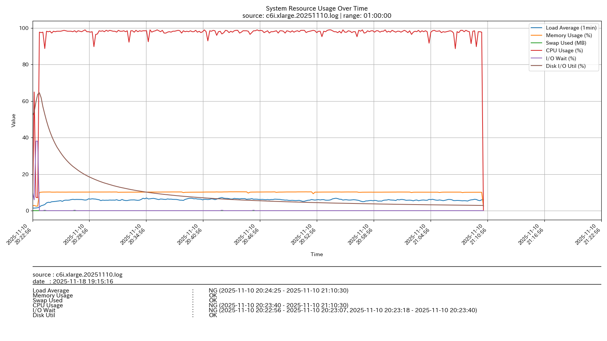
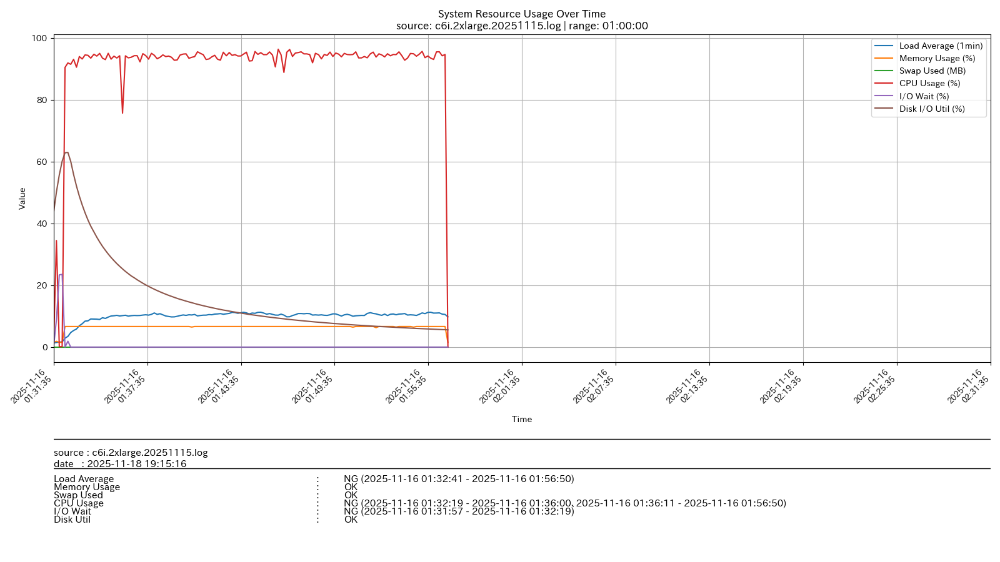
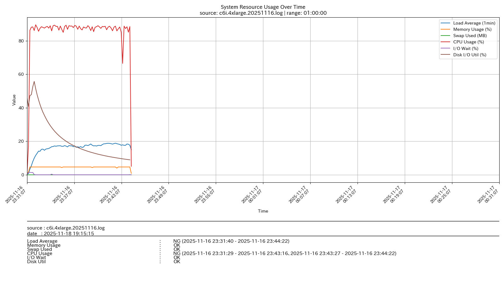

# インスタンスタイプ精査

## 1. 概要

### 1.1 目的
AWSインスタンスタイプごとのFFmpeg処理時間を比較し、最適なインスタンスを選定します。

### 1.2 関連文書

**参照文書**
- 基本設計書（[設計書/基本設計.md](基本設計.md)）
- run.sh詳細設計書（[設計書/run.sh_詳細設計書.md](run.sh_詳細設計書.md)）

## 2. 結論

- 同一ジョブ（入力ファイルのサイズは多少変化あり）を c6i.xlarge / c6i.2xlarge / c6i.4xlarge で実行した結果、ジョブ1本あたりの概算料金差は数円以内。待ち時間短縮を優先し、**c6i.4xlarge** を採用します。
- CPUコア数増によって処理時間は xlarge→4xlarge で約73%短縮（48分→13分）。キュー滞留が減り、夜間バッチの目視待機時間とピーク時の同時起動台数を抑えられます。
- リザーブド/スポット併用時も単価が近いなら「短時間で終わる方」を選ぶことで、中断・再実行時の運用リスクを低減できます。

## 3. 評価条件・手順

- **前提**: メディア変換バッチ（ffmpeg）で、1ジョブの待ち時間短縮によりオペレーター監視時間を減らし、同時実行枠（起動台数）を抑えることを目的とします。
- **条件**
  - 同一AMI／同一EBS設定で、インスタンスタイプのみを変更
  - ffmpegの同一ジョブを1本だけ実行（オプションは固定）
  - 換算レートは **1 USD = 150円**、オンデマンド時間単価で概算
- **手順**
  - インスタンスを起動し、同一UserData（`run.sh`）で ffmpeg と pigz をセットアップして1ジョブ実行します
  - 実行に要した時間を計測し、AWS公開のオンデマンド単価×経過時間で概算コストを算出します
  - simple-act ログから CPU/メモリ/IO を時系列で確認し、ボトルネックの有無を確認します

## 4. 計測結果・考察

| インスタンスタイプ | コア数(vcpu) | メモリ | 実行時間 | 概算料金（円） |
| :----------------: | :----------: | :----: | :------: | :----------: |
|     c6i.xlarge     |      4       |  8GB   |   48分   | ¥0.510/分 × 48分 = 24.48 |
|    c6i.2xlarge     |      8       |  16GB  |   25分   | ¥1.020/分 × 25分 = 25.50 |
|    c6i.4xlarge     |      16      |  32GB  |   13分   | ¥2.040/分 × 13分 = 26.52 |

- ジョブあたりの金額差は約2円以内ですが、処理時間は c6i.xlarge 比で約73%短縮（48分→13分）。
- CPUを増やしても時間短縮が線形にならないのは、デコード/エンコードやI/O待ちが単一スレッド寄りなためと推測。simple-act ログでは CPU 使用率は平均60%台、I/O Wait は10%未満。
- メモリは32GBでも余裕がありスワップ0MB。EBS %util も50%未満で、ストレージ起因の詰まりは見られません。
- 変換時間最優先なら c6i.4xlarge、待ち時間許容なら c6i.xlarge でも運用可能ですが、キュー滞留とオペレーター待機時間増に注意してください。
- グラフ（参考資料）で各インスタンスの利用状況を確認できます。

## 5. 運用上の留意点

- Spot 利用時は中断リスクを考慮し、13分で終わる c6i.4xlarge の方が再実行コストが小さくなります。
- 「1インスタンス1ジョブ」前提を変えて並列実行する場合は再計測を行い、I/O帯域に近づく場合はボリュームタイプやストライプ構成も検討します。
- 為替変動とAWS料金改定を踏まえ、四半期ごとにレートを見直します。リザーブド/セービングプラン適用時は別途試算します。

## 6. 環境・実行手順

- UserData 内で `run.sh` を実行します。`run.sh` は simple-act をバックグラウンド起動し、CPU/メモリ/IO を10秒間隔で取得した上で ffmpeg 変換を実行します。
- ffmpeg と pigz を都度インストールし、引数で渡したアーカイブを展開後、`*.MOV` をすべて mp4 に変換します。
- 取得した `simple-act.log` は後述のツールでグラフ化できます。

実行スクリプト（`run.sh`）の詳細は [設計書/run.sh_詳細設計書.md](run.sh_詳細設計書.md) を参照してください。

## 7. 参考資料

### 7.1 計測グラフ（PNG）

- 
- 
- 

### 7.2 アクティビティログ例

```
===== Host Activity Snapshot: 2025-11-16 23:31:07 =====

--- Uptime / Load Average ---
 23:31:07 up 1 min,  0 users,  load average: 0.68, 0.21, 0.07

--- Memory Usage ---
              total        used        free      shared  buff/cache   available
Mem:            30G        287M         25G        476K        5.4G         30G
Swap:            0B          0B          0B

--- CPU Usage (mpstat) ---
Linux 4.14.355-280.672.amzn2.x86_64 (ip-10-0-1-237.ap-northeast-1.compute.internal)     11/16/2025      _x86_64_        (16 CPU)

11:31:07 PM  CPU    %usr   %nice    %sys %iowait    %irq   %soft  %steal  %guest  %gnice   %idle
11:31:08 PM  all    0.06    0.00    0.06    0.00    0.00    0.00    0.57    0.00    0.00   99.30
Average:     all    0.06    0.00    0.06    0.00    0.00    0.00    0.57    0.00    0.00   99.30

--- Disk I/O (iostat) ---
Linux 4.14.355-280.672.amzn2.x86_64 (ip-10-0-1-237.ap-northeast-1.compute.internal)     11/16/2025      _x86_64_        (16 CPU)

avg-cpu:  %user   %nice %system %iowait  %steal   %idle
           2.36    0.00    1.46    2.50    0.75   92.93

Device:         rrqm/s   wrqm/s     r/s     w/s    rkB/s    wkB/s avgrq-sz avgqu-sz   await r_await w_await  svctm  %util
nvme0n1           0.00     5.43   75.35  289.40  2289.31 62296.61   354.14     4.87   14.71    0.87   18.32   1.27  46.19

　| 以下続く
```

### 7.3 グラフ作成スクリプト（log2graph.py）

`simple-act.log` を時系列グラフに変換するツールです。詳細は [運用手順書/ツール.md](../運用手順書/ツール.md) を参照してください。

---

**作成日**: 2025年11月16日
**更新日**: 2026年3月4日
**バージョン**: 1.1
**作成者**: tsystem
**承認者**: tsystem
