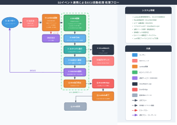
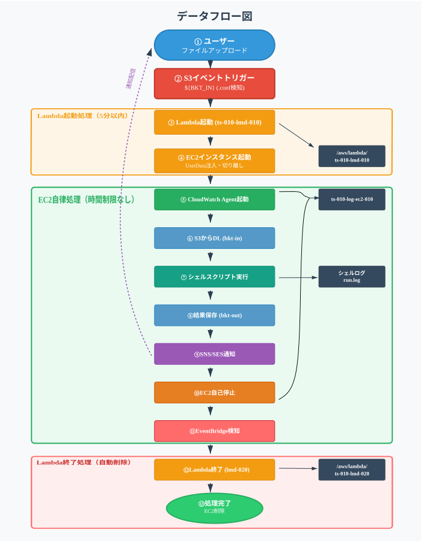

# 基本設計書 - S3イベント連携によるEC2自動処理

## 1. 概要

### 1.1 システム名
S3イベント連携によるEC2自動処理

### 1.2 関連文書

**参照文書**
- 要件定義書（[設計書/要件定義.md](要件定義.md)）

**派生文書**
- 命名基準書（[設計書/命名基準.md](命名基準.md)）
- 定義ファイル仕様書（[設計書/定義ファイル仕様.md](定義ファイル仕様.md)）
- セキュリティ設定一覧（[設計書/セキュリティ設定.md](セキュリティ設定.md)）
- UserDataスクリプト詳細設計書（[設計書/UserDataスクリプトの詳細設計書.md](UserDataスクリプトの詳細設計書.md)）
- run.sh 詳細設計書（[設計書/run.sh_詳細設計書.md](run.sh_詳細設計書.md)）
- インスタンスタイプ精査（[設計書/インスタンスタイプ精査.md](インスタンスタイプ精査.md)）
- 構築確認チェックリスト（[構築手順/構築確認チェックリスト.md](../構築手順/構築確認チェックリスト.md)）

### 1.3 目的
S3バケットへのファイルアップロードをトリガーとしてシェルスクリプト・プログラムを自動実行し、その処理結果をS3に保存するとともに、メールおよびSMSで通知します。処理基盤としてはローカルPCではなくAWS上の高性能なEC2を利用することで、バッチ処理をローカルPCより短時間で完了させることを目標とします。

### 1.4 システム構成と処理

以下にシステム構成と処理内容を記載します。



## 2. システムアーキテクチャ

### 2.1 全体アーキテクチャ
- **トリガー**: S3 Event Notification
- **オーケストレーション**: AWS Lambda
- **実行環境**: EC2 (Amazon Linux 2)
- **ストレージ**: S3
- **通知**: SNS (SMS) + SES (Email)
- **監視**: CloudWatch

### 2.2 主要コンポーネント
1. **S3バケット**: 入力ファイル、実行シェル、出力ファイル
2. **Lambda起動関数 (ts-010-lmd-010)**: 定義ファイル検証、EC2起動、エラー通知
3. **EC2インスタンス**: シェルスクリプト自律実行環境
4. **SNS/SES**: 通知システム（SMS・Email）
5. **EventBridge**: EC2停止イベント検知、Lambda終了関数起動
6. **Lambda終了関数 (ts-010-lmd-020)**: EC2インスタンス削除
7. **CloudWatch Logs**: リアルタイムログ監視

## 3. 機能仕様

### 3.1 主要機能
- **ファイルアップロード検知**: S3イベント監視（.confファイル検知）
- **定義ファイル解析**: 実行内容、通知先設定のバリデーション
- **EC2起動**: Lambda起動関数によるEC2インスタンス起動・UserData注入・切り離し
- **CloudWatch Agent起動**: リアルタイムログ送信準備
- **シェルスクリプト実行**: EC2上でのBash自律実行
- **結果ファイル保存**: S3出力バケットへの保存
- **通知機能**: メール・SMS送信（成功/失敗）
- **EC2削除**: EventBridge停止イベント検知 → Lambda終了関数によるインスタンス削除

### 3.2 定義ファイル仕様
```json
{
  "exec": "run.sh input.tar.gz",
  "log": "run.log",
  "result": "*.mp4 *act.log",
  "mail": "user@example.com",
  "sms": "+819012345678",
  "ec2_role_name": "ts-010-role-ec2-010",
  "subnet_name": "ts-010-subnet-010",
  "sg_name": "ts-010-sg-010",
  "ec2_instance_name_tag": "ts-010-ec2-010",
  "output_bucket": "${BKT_OUT}",
  "default_ami_id": "ami-09ed31f8f34719e20",
  "instance_type": "c6i.4xlarge",
  "ses_from_email": "sender@example.com",
  "key_name": "ts-010-keypair",
  "prj_prefix": "ts-010",
  "ebs_size": 50
}
```

**項目説明：**
- **prj_prefix**: プロジェクトプレフィックス（必須）
- **exec**: 実行コマンドと引数（必須）
- **log**: ログファイル名（必須）
- **result**: 結果ファイル名のパターン（必須）
- **mail**: 通知先メールアドレス（必須）
- **sms**: 通知先SMS番号（必須）
- **ec2_role_name**: EC2に割り当てるIAMロール名（必須）
- **subnet_name**: 起動するサブネット名（必須）
- **sg_name**: 適用するセキュリティグループ名（必須）
- **ec2_instance_name_tag**: EC2インスタンスのNameタグ（必須）
- **output_bucket**: 出力先S3バケット名（必須）
- **ses_from_email**: SESで利用する送信元メールアドレス（必須）
- **key_name**: EC2キーペア名（オプション）
- **instance_type**: EC2インスタンスタイプ（オプション、デフォルト: c6i.4xlarge）
- **ebs_size**: EBSルートボリューム容量GB（オプション、デフォルト: AMIのデフォルト）
- **ebs_type**: EBSボリュームタイプ（オプション、有効値: gp3, gp2, io1, io2）
- **timeout**: 処理タイムアウト秒数（オプション、範囲: 60〜21600秒）
- **default_ami_id**: 使用するAMIのID（オプション）

詳細は [設計書/定義ファイル仕様.md](定義ファイル仕様.md) を参照してください。

### 3.3 実行フロー

#### Lambda起動処理（5分以内）
1. S3バケット（`${BKT_IN}`）への定義ファイル配置
2. Lambda起動関数（`ts-010-lmd-010`）自動起動
3. 定義ファイル読み込み・検証（バリデーション）
4. EC2インスタンス起動（UserDataスクリプト設定）
5. Lambda処理完了・切り離し

#### EC2自律処理（時間制限なし）
1. CloudWatch Agent起動（ログ送信準備）
2. S3から実行ファイル・入力ファイルダウンロード（`${BKT_IN}`）
3. シェルスクリプト実行
4. CloudWatch Logsへリアルタイムログ送信
5. 結果ファイルS3アップロード（`${BKT_OUT}`）
6. 通知送信（メール・SMS、成功/失敗）
7. EC2インスタンス自己停止（`shutdown -h now`）

#### Lambda終了処理（自動削除）
1. EventBridgeがEC2停止イベント検知
2. Lambda終了関数（`ts-010-lmd-020`）自動起動
3. EC2インスタンス削除
4. 処理完了

## 4. AWS構成とリソース

### 4.1 S3バケット構成
```
${BKT_IN}/         入力専用バケット
├── run.conf           定義ファイル
├── run.sh             実行シェル
└── *.tar.gz           入力ファイル

${BKT_OUT}/        出力専用バケット
├── run.log            ログファイル
└── *.mp4              結果ファイル
```

### 4.2 Lambda関数仕様

#### Lambda起動関数 (ts-010-lmd-010)
- **ランタイム**: Python 3.12
- **メモリ**: 256MB
- **タイムアウト**: 5分
- **トリガー**: S3 Put Event (.confファイル)
- **IAM権限**: S3読み取り, EC2起動, SNS/SES, CloudWatch
- **処理内容**: 定義ファイル検証・EC2起動・エラー通知

#### Lambda終了関数 (ts-010-lmd-020)
- **ランタイム**: Python 3.12
- **メモリ**: 128MB
- **タイムアウト**: 30秒
- **トリガー**: EventBridge (EC2停止イベント)
- **IAM権限**: EC2削除, CloudWatch
- **処理内容**: EC2インスタンス削除のみ

### 4.3 EC2インスタンス仕様
- **AMI**: Amazon Linux 2
- **インスタンスタイプ**: c6i.4xlarge（デフォルト、定義ファイルで変更）
- **起動方式**: Lambda経由での動的起動
- **ストレージ**: EBS（動的設定）
  - **デフォルト容量**: AMIのデフォルト（ebs_size 未指定時）
  - **ボリュームタイプ**: gp3（汎用SSD、ebs_type 未指定時はAMIのデフォルト）
  - **容量範囲**: 10GB〜1000GB
- **セキュリティグループ**: アウトバウンドのみ
- **IAMロール**: S3読み書き, SNS, SES, CloudWatch
- **UserDataスクリプト**: 自律実行スクリプト設定
- **自動停止**: 処理完了後の自動終了

### 4.4 SNS/SES設定
- **SNS**: SMS送信（日本の携帯番号対応）
- **SES**: メール送信（送信者検証済み）
- **通知内容**: 処理完了・エラー

## 5. データフロー設計

### 5.1 データフロー
データフローの詳細を以下に示します。



**処理順序：**
1. ユーザーファイルアップロード
2. S3イベントトリガー
3. Lambda起動関数起動・バリデーション・EC2起動
4. Lambda処理完了・切り離し
5. EC2自律処理開始（CloudWatch Agent起動）
6. S3から実行ファイルダウンロード
7. シェルスクリプト実行（ログリアルタイム送信）
8. 結果S3保存・通知配信
9. SNS・SES通知
10. EC2自己停止
11. EventBridgeイベント検知
12. Lambda終了関数起動
13. EC2インスタンス削除完了

### 5.2 リソース命名規則

#### AWSリソース命名規則
**全てのAWSリソースは「ts-010-」プレフィックスで始まる命名規則とします**

詳細は [設計書/命名基準.md](命名基準.md) を参照してください。

**リソース命名例:**
- **S3バケット（入力）**: `${BKT_IN}`
- **S3バケット（出力）**: `${BKT_OUT}`
- **Lambda起動関数**: `ts-010-lmd-010`
- **Lambda終了関数**: `ts-010-lmd-020`
- **EC2インスタンス**: `ts-010-ec2-010`
- **IAMロール（Lambda起動）**: `ts-010-role-lambda-010`
- **IAMロール（Lambda終了）**: `ts-010-role-lambda-020`
- **IAMロール（EC2）**: `ts-010-role-ec2-010`
- **セキュリティグループ**: `ts-010-sg-010`
- **CloudWatchログ（Lambda）**: `ts-010-log-lambda-010`
- **CloudWatchログ（EC2）**: `ts-010-log-ec2-010`
- **SNSトピック**: `ts-010-sns-010`
- **EventBridgeルール**: `ts-010-rule-stop-ec2-trigger`

#### ファイル命名規則
- 定義ファイル: 任意（拡張子 `.conf`）
- 実行シェル: 任意　(拡張子`.sh`)
- 入力ファイル: 任意
- ログファイル: 任意　(拡張子`.log`)
- 結果ファイル: 任意

### 5.3 処理ステータス管理
- **CloudWatch**: 実行ログ・メトリクス（`ts-010-log-lambda-010`、`ts-010-log-ec2-010`）
- **S3**: 入力ファイル（`${BKT_IN}`）・結果ファイル・ログファイル（`${BKT_OUT}`）

## 6. エラーハンドリング設計

### 6.1 エラー分類
- **システムエラー**: AWS サービス障害
- **設定エラー**: 定義ファイル不正
- **実行エラー**: シェルスクリプト実行失敗
- **通知エラー**: SNS/SES送信失敗

### 6.2 エラー処理方針
- **タイムアウト制御**: 処理時間制限
- **エラー通知**: 緊急時の管理者通知

### 6.3 ログ設計
- **CloudWatch Logs**: 全処理ログ
- **S3ログ**: 詳細実行ログ
- **ログレベル**: INFO, WARNING, ERROR, CRITICAL

## 7. セキュリティ設計

### 7.1 アクセス制御
- **IAM Role**: 最小権限の原則
- **S3 Bucket Policy**: 特定IAMロールのみアクセス許可
- **EC2 Security Group**: アウトバウンドのみ許可

### 7.2 データ保護
- **S3暗号化**: AES-256
- **転送暗号化**: HTTPS/TLS

### 7.3 監査・監視
- **CloudTrail**: API呼び出し監査
- **CloudWatch**: メトリクス・アラーム
- **VPC Flow Logs**: ネットワーク監視

## 8. 運用設計

### 8.1 監視項目
- Lambda実行時間・エラー率
- EC2起動・停止状況
- S3アクセス・容量
- SNS/SES送信状況

### 8.2 アラート設定
- 処理失敗時の即座通知

### 8.3 バックアップ・復旧
- Lambda関数ソースコードのバックアップ

- インフラ構築用シェルのバックアップ

  いずれもgithubを使用することとします。

## 9. 費用概算

### 9.1 月額費用概算（8回/月実行想定）
- **Lambda**: $0.01
- **EC2**: $1.50（c6i.4xlarge 13分 × 8回）
- **S3**: $1.00（10GB）
- **SNS**: $0.05（SMS 8通）
- **SES**: $0.01（メール 8通）
- **合計**: 約$2.60/月

### 9.2 スケーラビリティ

初期リリースではスケーリングを考慮しません。

---

**作成日**: 2025年07月10日
**更新日**: 2026年04月07日
**バージョン**: 0.4
**作成者**: tsystem
**承認者**: tsystem
