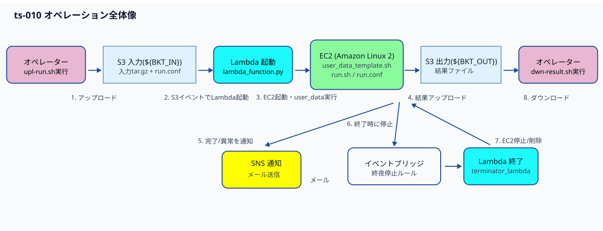
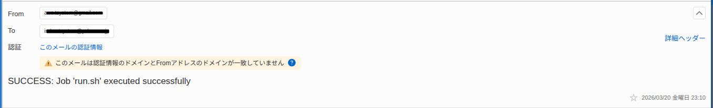

# 運用手順書 - S3イベント連携によるEC2自動処理

## 1. 概要

本手順書は、S3イベント連携によるEC2自動処理システムの日次運用手順を定めます。

### 1.1 関連文書

**参照文書**
- 基本設計書（[設計書/基本設計.md](../設計書/基本設計.md)）
- 定義ファイル仕様書（[設計書/定義ファイル仕様.md](../設計書/定義ファイル仕様.md)）
- run.sh 詳細設計書（[設計書/run.sh_詳細設計書.md](../設計書/run.sh_詳細設計書.md)）

**派生文書**
- ツール一覧（[運用手順書/ツール.md](ツール.md)）

---

## 2. 処理の全体像

S3へのアップロードを起点に Lambda が EC2 を起動し、処理完了後に結果を S3 へ保存して SNS/SES で通知し、EventBridge でインスタンスを自動削除します。



**手順の概要**

| ステップ | 作業内容 |
|---------|---------|
| 1 | 入力ファイルを tar.gz に圧縮 |
| 2 | `run.conf`（定義ファイル）を作成 |
| 3 | `upl-run.sh` でファイルをアップロード（Lambda が自動起動） |
| 4 | メール通知を確認して処理完了を把握 |
| 5 | 結果ファイルを S3 出力バケットから回収 |
| 6 | 入力バケットを削除 |

---

## 3. 事前準備

### 3.1 必要なファイル

| ファイル | 格納場所 | 説明 |
|---------|---------|------|
| 入力ファイル（`*.MOV` など） | 任意のローカルディレクトリ | EC2 上で処理する対象ファイル |
| `run.sh` | `work/run.sh` | EC2 上で実行されるシェルスクリプト |
| `run.conf` | `work/run.conf` | 実行パラメータ定義ファイル（JSON） |
| `upl-run.sh` | `work/upl-run.sh` | S3 アップロードスクリプト |

### 3.2 前提条件

- AWS CLI がインストール・設定済みであること
- `~/.aws/credentials` にデフォルト認証情報（`ts-010-user` のアクセスキー）が設定されていること
  - `upl-run.sh` / `aws-pop-bktobj.sh` / `aws-del-bktobj.sh` は内部で `aws sts assume-role` を実行するため、実行時に `AWS_PROFILE` の指定は不要
- `ts-010-role-exec` ロールを Assume できる IAM 権限を持つこと（`upl-run.sh` / `aws-pop-bktobj.sh` が使用）
- キーペア `ts-010-keypair` が AWS 上に存在すること（存在しない場合は「5. 異常時の対応」を参照）
- `work/.env` に環境変数が設定され、実行前に `source work/.env` していること（→ 3.3 参照）

### 3.3 環境変数の設定（初回のみ）

`upl-run.sh` 等のスクリプトは `${AWS_ACCOUNT_ID}` 等の環境変数を使用します。初回実行前に以下の手順で設定してください。

1. テンプレートをコピーして `.env` を作成します。

   ```bash
   cp src/conf/.env.skl src/conf/.env
   ```

2. `src/conf/.env` を編集して各値を設定します。

   ```bash
   vi src/conf/.env
   ```

   設定が必要な変数:

   | 変数名 | 説明 | 例 |
   |-------|------|---|
   | `AWS_ACCOUNT_ID` | AWS アカウント ID | `123456789012` |
   | `MAIL` | 通知メールアドレス（`run.conf` の初期値） | `user@example.com` |
   | `SMS` | SMS 送信先（`run.conf` の初期値） | `+819012345678` |
   | `SES_FROM_EMAIL` | SES 送信元メールアドレス | `from@example.com` |
   | `DEFAULT_AMI_ID` | デフォルト AMI ID（`run.conf` の初期値） | `ami-xxxxxxxxxxxxxxxxx` |

3. 各スクリプト実行前に環境変数を読み込みます。

   ```bash
   source work/.env
   ```

---

## 4. 運用手順

### ステップ1: 入力ファイルの圧縮

処理対象ファイル（例: `*.MOV`）を pigz で圧縮し、tar.gz アーカイブを作成します。

```bash
# 入力ファイルを tar.gz に圧縮（pigz で並列圧縮）
$ tar -cf - *.MOV | pigz -p 4 > YYYYMMDD.tar.gz
```

> **備考**: `tar.gz` ファイルは EC2 上の `run.sh` 内で展開・処理されます。

### ステップ2: run.conf の作成

`work/` ディレクトリで `mk-run.conf.sh` を実行し、対話的に `run.conf` を作成します。入力ファイルの圧縮で作成したファイル名を、run.shに続けて入力します。

```bash
$ cd work/
$ ./mk-run.conf.sh
```

スクリプトは `run.conf.skl` をデフォルト値として読み込み、各項目を対話的に入力します。スケルトンファイルの値をそのまま使う場合は Enter を押してください。

主要な設定項目（[設計書/定義ファイル仕様.md](../設計書/定義ファイル仕様.md) も参照）:

| 項目 | 説明 | 例 |
|-----|------|---|
| `exec` | EC2 上で実行するコマンド | `run.sh YYYYMMDD.tar.gz` |
| `log` | 実行ログのファイル名 | `run.log` |
| `result` | S3 に保存する結果ファイルパターン | `*.mp4 *act.log` |
| `mail` | 完了通知メールアドレス | `user@example.com` |
| `sms` | 完了通知 SMS（`+81` 始まり） | `+819012345678` |
| `instance_type` | EC2 インスタンスタイプ | `c6i.4xlarge` |
| `ebs_size` | EBS ボリュームサイズ（GiB） | `50` |

> **注意**: `run.conf` には個人情報（メールアドレス・電話番号）が含まれます。バージョン管理システムへのコミットは行わないでください。

実行例:

```
$ ./mk-run.conf.sh 
実行コマンド(exec) を入力してください [default: run.sh 20251115.tar.gz]: run.sh 20260315.tar.gz
ログファイル名(log) を入力してください [default: run.log]: 
結果ファイル(result) を入力してください [default: *.mp4 *act.log]: 
通知メールアドレス(mail) を入力してください [default: your-mail@example.com]: my-mail@address
SMS 送信先(sms) を入力してください [default: +8190XXXXXXXX]: +8190********
EC2 ロール名(ec2_role_name) を入力してください [default: ts-010-role-ec2-010]: 
サブネット名(subnet_name) を入力してください [default: ts-010-subnet-010]: 
セキュリティグループ名(sg_name) を入力してください [default: ts-010-sg-010]: 
EC2 インスタンスタグ(ec2_instance_name_tag) を入力してください [default: ts-010-ec2-010]: 
出力バケット名(output_bucket) を入力してください [default: ${BKT_OUT}]: 
デフォルト AMI ID(default_ami_id) を入力してください [default: ami-XXXXXXXXXXXXXXXXX]: ami-XXXXXXXXXXXXXXXXX
インスタンスタイプ(instance_type) を入力してください [default: c6i.2xlarge]: c6i.4xlarge
SES 送信元メール(ses_from_email) を入力してください [default: your-ses-from@example.com]: my-mail@address
キーペア名(key_name) を入力してください [default: ts-010-keypair]: 
プロジェクト接頭辞(prj_prefix) を入力してください [default: ts-010]: 
EBS サイズ(ebs_size) を入力してください [default: 50]: 
run.conf を作成しました: run.conf
$ cat run.conf
{
  "exec": "run.sh 20260315.tar.gz",
  "log": "run.log",
  "result": "*.mp4 *act.log",
  "mail": "my-mail@address",
  "sms": "+819*********",
  "ec2_role_name": "ts-010-role-ec2-010",
  "subnet_name": "ts-010-subnet-010",
  "sg_name": "ts-010-sg-010",
  "ec2_instance_name_tag": "ts-010-ec2-010",
  "output_bucket": "${BKT_OUT}",
  "default_ami_id": "ami-XXXXXXXXXXXXXXXXX",
  "instance_type": "c6i.4xlarge",
  "ses_from_email": "my-mail@address",
  "key_name": "ts-010-keypair",
  "prj_prefix": "ts-010",
  "ebs_size": "50"
}
$ 
```


### ステップ3: S3 へのアップロード

`work/` ディレクトリで `upl-run.sh` を実行します。

```bash
$ ./upl-run.sh
```

このスクリプトは以下を自動で行います:

1. `ts-010-role-exec` ロールを Assume して一時認証情報を取得

2. `run.conf` の `exec` フィールドに指定された入力ファイル（tar.gz ）をアップロード

3. `run.sh` をアップロード

4. `run.conf` をアップロード（← このアップロードで Lambda が自動起動）

5. upl-run.sh.logの確認(最終行が、The system should now be triggered.と記載されている場合は、EC2が正常に起動しています。)

Lambda が起動すると EC2 インスタンスが自動で立ち上がり、バッチ処理が開始されます。

実行例:

```bash
$ tail -1 ./upl-run.sh.log
2026-03-20 22:52:50 Upload complete. The system should now be triggered.
```
Lambda ログを監視する場合(全ストリームの最新ログイベントがまとめて時系列で人間の読みやすい整形済みテキストで出力):

```bash
$ aws logs tail /aws/lambda/ts-010-lmd-010 --follow
```

lambda終了後、EC2インスタンスの処理ログは、以下のコマンドで確認が可能です。:

```
$ aws logs tail ts-010-log-ec2-010 --no-cli-pager
2026-03-20T13:53:34.438000+00:00 i-xxxxxxxxxxxxxxxxx Cloud-init v. 19.3-46.amzn2.0.6 running 'init-local' at Fri, 20 Mar 2026 13:53:03 +0000. Up 4.03 seconds.
|略
2026-03-20T14:10:10.439000+00:00 i-xxxxxxxxxxxxxxxxx Sending notification...
2026-03-20T14:10:10.690000+00:00 i-xxxxxxxxxxxxxxxxx SMS: +81XXXXXXXXXXX
2026-03-20T14:10:10.690000+00:00 i-xxxxxxxxxxxxxxxxx An error occurred (AuthorizationError) when calling the Publish operation: User: arn:aws:sts::123456789012:assumed-role/ts-010-role-ec2-010/i-xxxxxxxxxxxxxxxxx is not authorized to perform: SNS:Publish on resource: +81XXXXXXXXXXX because no identity-based policy allows the SNS:Publish action
2026-03-20T14:10:10.690000+00:00 i-xxxxxxxxxxxxxxxxx ERROR: Failed to send SMS notification
2026-03-20T14:10:11.191000+00:00 i-xxxxxxxxxxxxxxxxx Email: user@example.com
2026-03-20T14:10:11.191000+00:00 i-xxxxxxxxxxxxxxxxx {
    "MessageId": "0106019d0b950d63-e6384f9b-01a8-4038-acfe-b3f7ff090e71-000000"
2026-03-20T14:10:11.191000+00:00 i-xxxxxxxxxxxxxxxxx }
2026-03-20T14:10:15.439000+00:00 i-xxxxxxxxxxxxxxxxx --- All tasks finished. Terminating instance. ---
$ 
```

### ステップ4: 処理完了の確認

`run.conf` に指定したメールアドレスに完了通知が届くまで待ちます。メールには処理結果（成功/失敗）と実行時間が記載されています。



EC2 の状態を確認する場合:

```bash
aws ec2 describe-instances \
  --filters Name=tag:Name,Values=ts-010-ec2-010 \
  --query 'Reservations[].Instances[].{Id:InstanceId,State:State.Name}'
```

### ステップ5: 結果ファイルの回収

**EC2 が停止・削除されていることを確認してから**ダウンロードします。

実行前に環境変数が読み込まれていることを確認します（`AWS_ACCOUNT_ID` が必要）。

```bash
source work/.env   # 未実施の場合のみ
cd work/
./aws-pop-bktobj.sh
```

このスクリプトは:

1. `ts-010-role-exec` ロールを Assume
2. `${BKT_OUT}` の全オブジェクトを `work/downloaded_files/` にダウンロード
3. ローカルファイルサイズと S3 サイズが一致した場合のみ S3 から削除
4. バケットにオブジェクトが存在しない場合は `Nothing to do.` を出力して正常終了

> **注意**: ダウンロード前に EC2 が完全に停止・削除されていることを確認してください。EC2 の処理中にダウンロードすると、途中のファイルを取得してしまう可能性があります。

### ステップ6: 入力バケットのクリア

結果回収後、入力バケット内のオブジェクトを削除します。

```bash
source work/.env   # 未実施の場合のみ
cd work/
./aws-del-bktobj.sh
```

このスクリプトは `${BKT_IN}` の全オブジェクトを削除します。

---

## 5. 異常時の対応

### Lambda が起動しない

1. S3 バケット通知設定を確認します

   ```bash
   AWS_PROFILE=ts-usr-admin aws s3api get-bucket-notification-configuration --bucket ${BKT_IN}
   ```

   通知設定が空の場合は S3 トリガーが失われています。S3トリガーが正しく設定されている場合は、以下のように表示されます。

   ```
   $ AWS_PROFILE=ts-usr-admin aws s3api get-bucket-notification-configuration --bucket ${BKT_IN}
   LAMBDAFUNCTIONCONFIGURATIONS    lambda-trigger-for-conf-files   arn:aws:lambda:ap-northeast-1:123456789012:function:ts-010-lmd-010
   EVENTS  s3:ObjectCreated:*
   FILTERRULES     Suffix  .conf
   $ 
   ```

   S3トリガーが設定されていない場合は、以下を実行して再設定します。

   ```bash
   cd infra/
   source ./assume-role.sh
   ./mk-s3-trigger.sh
   ```

2. Lambda の最新ログでエラー内容を確認します

   ```bash
   # 最新ログストリームの全イベントを取得（システムユーティリティ）
   aws-get-lastlog.sh /aws/lambda/ts-010-lmd-010
   ```

   リアルタイム監視する場合:

   ```bash
   aws logs tail /aws/lambda/ts-010-lmd-010 --follow
   ```

3. アップロードしたファイルが `.conf` 拡張子で終わっているか確認します（Lambda のトリガー条件）

### EC2 が起動しない

#### キーペアが存在しない場合（`InvalidKeyPair.NotFound`）

メール通知に以下のエラーが含まれる場合、キーペアが失われています。

```
Error: An error occurred (InvalidKeyPair.NotFound) when calling the RunInstances operation:
The key pair 'ts-010-keypair' does not exist
```

`infra/` ディレクトリでキーペアを再作成します。

```bash
cd ~/run_on_ec2
source src/conf/.env
source infra/assume-role.sh      # ts-010-role-build を Assume
cd infra
./mk-keypair.sh
```

作成完了後、`work/` ディレクトリに戻って `upl-run.sh` を再実行します。

```bash
cd ~/run_on_ec2/work
./upl-run.sh
```

> **備考**: キーペアはインフラ再構築時（`del-all.sh` 実行後）に消失します。`mk-keypair.sh` の実行漏れが原因の場合がほとんどです。

#### その他の EC2 起動エラー

1. Lambda ログで EC2 起動エラーを確認します
2. SNS/SES 通知でエラーメッセージが届いていないか確認します

### 処理が途中で止まった / 失敗した

1. EC2 が自動停止・削除されるか待ちます（EventBridge + Lambda 終了関数が自動処理）
2. CloudWatch ログ（`ts-010-log-ec2-010`）で EC2 側のエラーログを確認します
   ```bash
   aws logs tail ts-010-log-ec2-010 --follow
   ```
3. 必要に応じて入力バケットをクリアし、再実行します

### EC2 が停止しない（長時間稼働している）

手動で終了する場合:

```bash
# インスタンス ID を確認
aws ec2 describe-instances \
  --filters Name=tag:Name,Values=ts-010-ec2-010 \
  --query 'Reservations[].Instances[].{Id:InstanceId,State:State.Name}'

# 手動終了
aws ec2 terminate-instances --instance-ids <InstanceId>
```

---

**作成日**: 2026年3月4日
**バージョン**: 1.2
**最終更新**: 2026年3月30日
**作成者**: tsystem
**承認者**: tsystem
